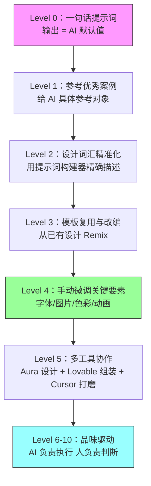

# AI 做网站，为什么你的总像流水线产品？——从「生成」到「设计」的十个层级

**一句话导读：** AI 生成网站已经人人可用，但大多数人卡在了「能生成」和「看起来不像 AI 做的」之间——这篇文章拆解了跨过这道鸿沟的完整方法。

**适合谁看：**
- 用过 v0、Lovable、Bolt 等 AI 建站工具，但产出总像模板的人
- 想用 AI 快速出设计方案，但不愿作品看起来像"AI 味"的设计师
- 需要快速搭建落地页的独立开发者或创业者
- 正在评估 AI 设计工具选型的产品经理
- 想理解 AI 设计工具能力边界和正确用法的技术从业者

**读完你会获得什么：**
- 理解 AI 生成网站为什么总会趋同，以及这个趋同的本质原因
- 掌握从「一句话提示词」到「有设计感的成品」的完整工作流
- 能正确区分 AI 擅长和 AI 不擅长的设计环节
- 建立一套可复用的设计词汇体系，让提示词从模糊变精确
- 能组合使用多个工具（Aura + Lovable + Cursor 等）完成高质量落地页
- 避开「依赖 AI 做一切」和「完全手动」两个极端

---

## 01 背景：为什么这个问题现在值得讨论

2024 年底到 2025 年初，AI 生成前端代码的能力发生了质变。Claude 3.5 还在做"能用但不好看"的 HTML，而 Claude 4 Sonnet / Opus 已经能生成结构完整的交互页面。v0、Lovable、Bolt、Aura 等工具把门槛进一步压低——输入一句话，等几十秒，你就有一个网站。

但问题也随之暴露：**所有人输入一句话，得到的东西越来越像。**

大号加粗标题、Inter 字体、紫色渐变、白底卡片——这些是当前 AI 生成网页的默认审美。它不是某个工具的问题，而是训练数据和模型偏好共同作用的结果。当数百万人在同一批模型上用相似的提示词，输出必然趋同。

这不是要否定 AI 建站的价值。恰恰相反——AI 已经能做到 70-80 分的基线质量，这本身就是巨大的进步。问题在于：**70 分现在是大众起点，不是终点。** 你要做的不是纠结"AI 能不能做网站"，而是学会怎么从 70 分走到 90 分。

---

## 02 核心判断：视频真正想讲的不是提示词技巧

这个视频表面在讲「怎么用 Aura 做好看的网站」，实际在讲一个更根本的问题：**AI 是设计工具，不是设计替代品。**

大多数人使用 AI 建站工具的方式是：给一句话提示词 → 等结果 → 不满意 → 换一句话 → 再等 → 还是不满意 → 放弃。这个循环的问题不在于提示词不够好，而在于把 AI 当成了"输入需求、输出成品"的黑箱。

正确的方式是：**用 AI 完成 90% 的基础工作，但最后 10% 的设计决策——字体选择、图片风格、动画质感、色彩搭配——必须由人来做。** 这 10% 不是体力活，是品味和判断力。AI 可以生成一千种按钮样式，但它不知道哪一种适合你的产品。这是人必须掌握的能力。

换句话说，AI 降低了"做出来"的门槛，但没有降低"做好"的门槛。做好，仍然需要你懂设计语言。

---

## 03 概念澄清：先把关键名词讲准确

### 生成式设计（Generative Design）

- 它是什么：AI 根据文本描述自动生成前端代码和视觉布局
- 它解决什么问题：让不会写代码的人也能快速出网页原型
- 它不是什么：它不是"AI 替你做设计决策"——它生成的是可能性，不是最终答案
- 和传统模板的区别：模板是固定的，生成式设计的每次输出都不同，但会趋同于训练数据的偏好
- 例子：输入"做一个 AI 浏览器的落地页"，v0 生成一个紫色渐变页面，Lovable 生成另一个紫色渐变页面——不同但同质

### 提示词构建器（Prompt Builder）

- 它是什么：一个将设计要素拆解为可选项的工具，帮你用选择题代替填空题来构建提示词
- 它解决什么问题：大多数人不知道设计词汇（什么是 bento layout、什么是 glass style），导致提示词模糊
- 它不是什么：它不是自动优化提示词——它只是给了你一个词汇表
- 和直接写提示词的区别：直接写是"做一个好看的页面"，提示词构建器是"做一个 future section、bento layout、card presentation、glass style、light mode、instrument serif 字体的页面"
- 例子：Aura 的提示词构建器把"页面"拆成区块类型→布局→呈现方式→风格→色彩模式→字体，六层选项逐步精确

### 设计趋同（Design Homogenization）

- 它是什么：大量使用同一批 AI 工具和模型的人，产出的设计在视觉上越来越相似
- 它解决什么问题：它不是要解决的问题，而是需要认识的现象
- 它不是什么：它不是"AI 做不出好设计"——AI 能做出好设计，但默认路径通向趋同
- 和模板化的区别：模板化是显式复制，设计趋同是隐式收敛——你甚至不知道为什么都长一样
- 例子：2025 年上半年的 AI 生成网页几乎都使用 Inter 字体、紫色主色、大号标题——这不是巧合，是模型偏好的体现

### 品味驱动设计（Taste-Driven Design）

- 它是什么：在设计决策中，依靠人的审美判断力来做最终选择，而不是全权交给 AI
- 它解决什么问题：突破 AI 默认输出的趋同倾向，让设计有独特性
- 它不是什么：它不是"手动从零开始"——你仍然用 AI 生成基础版本
- 和传统设计的区别：传统设计是从零到一百全靠人，品味驱动设计是 AI 走到九十，人来走最后十步
- 例子：AI 生成了一个 Inter 字体的落地页，你手动换成 Instrument Serif、加上 Spline 3D 背景、替换 Midjourney 图片——每一步都是品味判断

---

## 04 整体框架：AI 设计能力层级模型

视频的核心内容可以重构为一个「AI 设计能力层级模型」，从 Level 0 到 Level 10：

**层级解释：**

- **Level 0（大多数人的起点）**：一句话提示词，输出完全取决于 AI 默认偏好。结果趋同，缺乏个性。
- **Level 1**：开始给 AI 具体的参考对象——"像 Arc 浏览器那样"、"像 Linear 那样"。AI 的训练数据里有这些产品，所以能近似。
- **Level 2**：学会设计词汇。不说"好看的"，而是说"bento layout + glass style + instrument serif"。精确度决定输出质量。
- **Level 3**：不再从零开始，而是从已有的高质量模板出发，Remix（改编）成自己需要的版本。效率高得多。
- **Level 4（关键分水岭）**：AI 生成基础版本后，你手动调整字体、替换图片、修改色彩、加入动画。**这是区分"AI 作品"和"有设计感的作品"的关键步骤。**
- **Level 5**：意识到没有单一工具能做好所有事。用 Aura 做视觉设计，把代码导出到 Lovable 或 Cursor 完成功能组装。
- **Level 6-10**：AI 负责执行和迭代，人负责判断和选择。这是长期方向——工具会越来越强，但品味始终是差异化来源。

---

## 05 关键机制：AI 生成设计为什么会趋同

### 训练数据的偏好

- **输入**：互联网上已有的网页设计
- **处理**：模型学习到高频模式——大号无衬线标题、紫色渐变、卡片布局、Inter 字体
- **输出**：当提示词模糊时，模型倾向于输出训练数据中出现频率最高的模式
- **为什么这样设计**：这是统计学习的本质——模型追求的是"大概率正确"，不是"独特创新"
- **代价**：高频模式 = 安全但平庸。你得到的是统计均值，不是设计峰值
- **适合/不适合**：适合快速出原型，不适合做最终成品

### 模型风格偏好

- **输入**：同一段提示词
- **处理**：Claude Sonnet 4 倾向于用紫色和 Inter，Claude Opus 4 更有细节但"懒"一些，不同模型有不同的默认风格
- **输出**：同一需求在不同模型上产生不同风格，但同一模型的结果高度相似
- **为什么这样设计**：模型的风格偏好来自训练时的权重分布，不是有意的"默认审美"
- **代价**：如果不了解模型偏好，你会困惑于"为什么换了个工具还是差不多的结果"
- **适合/不适合**：了解偏好后，可以在不同场景选不同模型——需要细节选 Opus，需要创意选 Sonnet

### 提示词精度与输出质量的关系

- **输入**：从一句话到六层精确描述
- **处理**：提示词越精确，模型可发挥的"默认空间"越小，输出越接近你的意图
- **输出**：精确提示词的输出质量显著高于模糊提示词
- **为什么这样设计**：模糊提示词给模型太多自由度，模型会填入训练数据的高频模式
- **代价**：精确提示词需要你懂设计词汇——这本身就是学习成本
- **适合/不适合**：有设计基础的人适合精确提示词，新手可以从模板 Remix 开始，不一定要从提示词起步

---

## 06 方法拆解：从 Level 0 到 Level 4 的落地步骤

### 第一步：建立审美基准

- **目标**：知道自己要什么，而不是让 AI 决定你要什么
- **具体动作**：收集 5-10 个你喜欢的网站，分析它们的共同特征。Arc Browser、Perplexity Comet、Linear、Apple——这些都是当前设计标杆
- **判断标准**：你能说出"我喜欢它的字体/布局/动画/色彩"中的至少一项具体原因
- **常见坑**：只收集不分析。看了一百个网站但说不清自己喜欢什么，等于没看
- **产出物**：一份简短的审美参考清单，写明每个参考对象的具体可学习要素

### 第二步：用提示词构建器精确描述需求

- **目标**：把"做一个好看的页面"变成六层精确描述
- **具体动作**：使用 Aura 的提示词构建器（或自己列出清单），逐层选择：
  1. **区块类型**：hero section / feature section / testimonial / pricing...
  2. **布局方式**：bento / sidebar / grid / split...
  3. **呈现形式**：full screen / card / browser frame...
  4. **视觉风格**：glass / liquid glass / flat / neumorphic...
  5. **色彩模式**：light / dark / primary color / background...
  6. **字体选择**：instrument serif / playfair / manrope / geist...
- **判断标准**：你的提示词长度至少 50 词，包含至少 4 个具体设计属性
- **常见坑**：跳过字体选择——字体是区分"AI 作品"和"设计作品"最明显的单一要素。AI 默认用 Inter，换掉它效果立竿见影
- **产出物**：一段完整的设计提示词

### 第三步：从模板 Remix 而不是从零生成

- **目标**：以高质量设计为起点，而不是以 AI 默认输出为起点
- **具体动作**：在 Aura 的模板库（1000+ 模板）或社区中找到接近你需求的模板，点击 Remix，在原有基础上修改
- **判断标准**：Remix 的起点质量应该明显高于你从零提示词得到的版本
- **常见坑**：花太多时间找"完美模板"。没有完美模板，找一个 70% 匹配的快速改
- **产出物**：一个基于模板的初始版本

### 第四步：手动微调关键设计要素（最关键的 10%）

- **目标**：突破 AI 默认审美，让设计有个性
- **具体动作**，按优先级排序：
  1. **换字体**：从 Inter 换成 Instrument Serif / Playfair / Geist——效果最明显
  2. **换图片**：从 Unsplash 通用图换成 Midjourney 生成的定制图片
  3. **加背景动画**：用 Spline 3D 或 Lottie 动画替换纯色背景
  4. **调色彩**：从默认紫色换成与你品牌匹配的颜色
  5. **精调阴影和间距**：AI 常常过度或不足——手动微调细节
- **判断标准**：让你的设计在缩略图级别就能和"AI 默认输出"区分开
- **常见坑**：试图让 AI 做所有微调——"帮我换个字体"在 Lovable 里可能要等 30 秒而且结果不可控。在 Aura 里手动切换字体是秒级操作
- **产出物**：一个有独特视觉特征的页面

### 第五步：导出代码，在功能型工具中完成组装

- **目标**：设计归设计，功能归功能
- **具体动作**：从 Aura 复制 HTML/CSS 代码，粘贴到 Lovable 或 Cursor 中，用提示词让 AI 把你的设计整合到功能完整的网站里
- **判断标准**：最终网站既有你的设计风格，又有完整的交互功能
- **常见坑**：在 Lovable 中丢失设计细节——AI 会倾向于"标准化"你的代码。解决方法：在提示词中明确要求"保持原代码的字体和样式"
- **产出物**：一个可发布的落地页

---

## 07 案例讲解：从一句话到一个有设计感的落地页

**场景背景**：你需要为一个 AI 浏览器产品做落地页。你没有任何设计团队，自己也不是专业设计师。

**遇到的问题**：直接在 v0 或 Lovable 输入"create a beautiful landing page for a new AI browser"，得到的是——大号 Inter 标题、紫色渐变、白色卡片。和另外一千个人的输出几乎一样。

**按框架处理：**

**步骤一（建立基准）**：打开 Arc Browser 和 Perplexity Comet 的官网，分析它们为什么好看——定制字体、3D 动画背景、独特的图片风格、精心设计的间距和阴影。

**步骤二（精确提示词）**：不再写"beautiful landing page"，而是写："a landing page for an AI browser, hero section with bento layout, card presentation, glass style, dark mode, instrument serif typeface, large drop shadows, with animated 3D background"。

**步骤三（模板出发）**：在 Aura 中找到已有的 AI 浏览器落地页模板，Remix 它，而不是从空白页开始。

**步骤四（手动微调）**：
- 字体从默认 Inter 切换为 Instrument Serif（一键切换，效果立现）
- 背景从纯色替换为 Spline 3D 动画（复制 Spline 导出链接，粘贴到 Aura）
- 图片从 Unsplash 通用图替换为 Midjourney 生成的抽象视觉图
- 按钮样式从默认圆角矩形改为从 UIVerse 复制的自定义 CSS 样式
- 阴影从普通单层改为三层叠加的质感阴影

**步骤五（组装发布）**：从 Aura 导出代码，粘贴到 Lovable 中，提示："Replace the testimonial section of my existing landing page with this code, keeping the font and style consistent."

**最终结果**：一个有定制字体、3D 动态背景、AI 生成图片、质感阴影的落地页。从视觉上，它不再像"AI 做的"——虽然 AI 完成了 90% 的工作量，但人做出的 10% 决策决定了它看起来不像流水线产品。

**这说明了什么**：AI 生成的天花板不在于 AI 的能力，而在于你的设计词汇量和品味判断力。**你不知道的选项，你就不可能选择。**

---

## 08 常见误区

### 误区一："提示词越长越好"

- **错误理解**：堆砌形容词和细节就能得到更好的结果
- **为什么错**：AI 模型对过长的提示词会丢失重点，甚至会互相矛盾。关键不是长度，是精确度
- **正确理解**：提示词要精确而非冗长。"glass style"比"看起来很现代很高级很透亮"有效得多
- **应该怎么做**：用设计术语替代日常形容词，六层结构各选一项即可

### 误区二："换一个 AI 工具就能解决趋同问题"

- **错误理解**：v0 不好用就换 Lovable，Lovable 不好用就换 Bolt
- **为什么错**：底层模型相似，训练数据相似，默认输出必然相似。换工具换的是交互方式，不是设计基因
- **正确理解**：趋同是模型层面的特征，不是工具层面的 bug
- **应该怎么做**：换工具不如换方法——用精确提示词、模板 Remix、手动微调来突破趋同，而不是换一个工具重新"一句话出图"

### 误区三："AI 能做一切，我只需要写提示词"

- **错误理解**：所有设计决策都可以通过提示词让 AI 完成
- **为什么错**：AI 对模糊需求的回应是填充默认值。你不说换字体，它就用 Inter。你不说要什么动画，它就不加。你越依赖提示词，结果越趋同
- **正确理解**：提示词控制方向，手动调整控制细节。两者缺一不可
- **应该怎么做**：AI 生成基础版本后，至少手动调整字体、图片和背景——这三个要素的改变效果最明显

### 误区四："手动调整就是倒退回传统设计"

- **错误理解**：既然都用 AI 了，还要手动改，那 AI 有什么意义
- **为什么错**：传统设计是从零到一百全靠人，手动微调是从九十到一百靠人——工作量差十倍
- **正确理解**：AI 完成的是体力活和重复劳动，人完成的是判断和选择。这是分工，不是倒退
- **应该怎么做**：拥抱"AI 做 90%，人做 10%"的模式。你的 10% 不是在重复 AI 的活，是在做 AI 做不好的活

### 误区五："好设计需要好工具，我用免费版所以做不好"

- **错误理解**：产出不好是因为工具限制，不是方法问题
- **为什么错**：视频中的嘉宾明确说了——Aura 的所有模板代码都是免费的，不需要付费就能复制 HTML。关键资源（Spline 社区动画、UIVerse 按钮、Midjourney 风格参考图片）也大多免费
- **正确理解**：免费版可能限制生成次数，但不限制设计质量
- **应该怎么做**：先用免费资源（Aura 模板代码 + Spline 社区 + UIVerse + Unsplash）做到 80 分，再考虑是否需要付费工具

### 误区六："第一次生成不满意就该放弃"

- **错误理解**：AI 建站工具不好用，试了一次就放弃了
- **为什么错**：第一次生成几乎永远是 Level 0 的结果——这是工具的起点，不是上限
- **正确理解**：AI 建站是一个迭代过程，不是一次成型。你需要 3-5 轮调整才能得到满意结果
- **应该怎么做**：把第一次生成当成起点而非终点。按"换字体→换图片→加动画→调色彩"的顺序迭代

### 误区七："只要提示词里提到参考网站，AI 就能做出一样好的设计"

- **错误理解**：说"像 Arc 那样"就够了
- **为什么错**：AI 能近似参考对象的布局结构，但做不出定制字体、3D 动画、独特图片这些细节——这些恰恰是参考网站好看的真正原因
- **正确理解**：参考网站的价值在于帮你建立审美基准，而不是让 AI 复制
- **应该怎么做**：分析参考网站好在哪里（字体？动画？间距？），把这些要素翻译成具体的设计选择，而不是只提名字

---

## 09 实战清单

### 立即能做

1. **收集你的审美参考清单**：找出 5 个你觉得设计感强的网站，写明每个网站你具体喜欢什么（字体、布局、色彩、动画），存为你的设计参考文档
2. **把你的提示词从一句话升级为六层结构**：下次用 AI 建站时，按"区块类型→布局→呈现→风格→色彩→字体"六层写提示词，对比前后输出差异
3. **去 Aura 免费浏览模板**：即使不付费，也可以在 aura.build 浏览 1000+ 模板，复制 HTML 代码，免费获得高质量设计起点
4. **换掉 Inter 字体**：你现在做的任何 AI 生成页面，第一步就把字体从 Inter 换成 Instrument Serif 或 Playfair——观察效果变化

### 一周内能做

5. **试用 Spline 3D 动画**：去 spline.design/community 找一个免费的 3D 背景动画，导出链接，嵌入你的落地页背景
6. **用 UIVerse 找一个独特的按钮样式**：去 uiverse.io 浏览按钮组件，复制 CSS，手动替换你页面中的默认按钮
7. **练习一次完整工作流**：从 Aura 生成/Remix 一个页面 → 手动微调字体和图片 → 导出代码到 Lovable 组装成完整网站。完整走一遍
8. **对比不同模型的风格差异**：同一段提示词，分别在 Claude Sonnet 和 Claude Opus 上生成，记录两个模型在色彩、字体、细节处理上的默认偏好差异

### 长期要沉淀

9. **建立你的设计词汇库**：持续积累设计术语——layout 类型、style 类型、字体名称、色彩方案。你不知道的选项，你就不可能选择
10. **形成你的品味判断力**：持续关注 Arc、Linear、Apple 等设计标杆的产品更新，分析它们做了什么改变，为什么这样改。品味是观察力的积累
11. **建立你的组件库**：把你每次调整满意的按钮样式、卡片组件、配色方案保存下来，未来直接复用。这是你的设计资产

---

## 10 总结

AI 建站工具解决了"从零到有"的问题。一句话提示词，30 秒，你就有了一个能用的网页。这是 2024 年之前不可能的事。

但"能用"和"好看"之间隔着一道鸿沟。这道鸿沟的名字叫"趋同"。当所有人用同一批模型、同样的模糊提示词，输出必然相似。Inter 字体、紫色渐变、大号加粗标题——这不是某个工具的问题，这是统计学习的必然结果。

跨过这道鸿沟的方法不是换工具，也不是写更长的提示词，而是学会设计语言。当你知道 bento layout、glass style、instrument serif 这些词意味着什么，你才有可能在提示词中精确表达你的意图。当你知道 Spline 能做 3D 背景、UIVerse 有按钮组件、Midjourney 能生成定制图片，你才有可能在 AI 生成的基础上做有意义的微调。

**AI 的能力天花板正在快速提高。六个月后，AI 生成的设计可能从 Level 1 升到 Level 5。但无论 AI 走到哪一步，品味始终是人的差异化来源。** 你不需要学会写代码，但你需要学会做判断——这个字体适不适合、这个动画够不够精致、这个配色对不对味。这些判断力，才是 AI 时代设计师真正的护城河。
