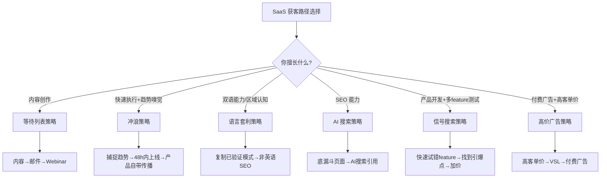

# SaaS 获客的六套可复制打法：从 0 到首个 $10K MRR 的路径选择

一句话导读：大多数人卡在"做出了产品但没人用"，这篇文章拆解了六套已被验证的获客打法，帮你根据自己的技能和资源选对路径。

适合谁看：
- 已经有一个 SaaS 产品（或正在做），但获客为零或极低的人
- 用 AI 快速搭建了工具，不知道怎么推向市场的独立开发者
- 想从零开始做 SaaS 但对营销完全没有头绪的人
- 有一定内容能力但还没找到产品-内容匹配点的创作者

读完你会获得什么：
- 理解六套获客打法各自的运行逻辑和适用条件
- 能判断哪套打法最匹配自己的技能和产品类型
- 掌握"隐性销售"内容创作、等待列表构建、SEO 低竞争切入等具体方法
- 识别"AI 搜索"作为新兴获客渠道的机会窗口
- 避开"只管做不管卖"、低价产品烧钱投广告等常见错误
- 有一份可立即执行的行动清单

---

## 01 背景：为什么这个问题现在值得讨论

2024-2025 年，AI 工具让"做一个 SaaS"的门槛骤降。Vibe coding、低代码平台、AI 生成代码——一个人花一个周末就能搭出一个能用的产品。但问题随之而来：**做出产品的人越来越多，知道怎么卖产品的人没有变多。**

视频嘉宾 Rob 指出了一个现实：社交平台上到处是"我做了一个 SaaS"的帖子，但真正跑通获客的极少。大多数人会写代码，但不会做营销；能做产品，但不知道怎么让人掏钱。

这不是一个新问题，但 AI 时代让它变得更尖锐了——因为产品端的瓶颈被消除了，获客成了唯一瓶颈。

---

## 02 核心判断：获客不是"更努力地卖"，而是选对路径再发力

这六套打法的真正价值不在于任何单一步骤的技巧，而在于一个判断：**获客策略必须和你的技能、产品类型、资源禀赋匹配。** 你擅长内容创作，就该走内容驱动路线；你反应快、执行力强，就该走趋势捕捉路线；你懂 SEO，就该走搜索流量路线。

选错路径比不努力更致命。一个不擅长写内容的人硬做 LinkedIn 帖子，一个低价产品硬投广告，一个不懂 SEO 的人硬做内容站——这些都会以"我很努力但没有结果"收场。

六套打法是六条不同的路径。每条路径都已经被真实公司验证过，但你只需要选一条走深。

---

## 03 概念澄清：先把关键名词讲准确

### MRR（Monthly Recurring Revenue）
- 月度经常性收入。SaaS 最核心的营收指标。
- 它衡量的是"每个月稳定能收到的钱"，不是一次性收入。
- 它不是总营收，不是利润，不包含一次性费用。
- 和 ARR 的关系：ARR = MRR × 12。
- 例：一个 SaaS 有 100 个付费用户，每人 $99/月，MRR 就是 $9,900。

### 等待列表（Waitlist）
- 产品正式发布前收集潜在用户的邮箱列表。
- 它解决的是"冷启动"问题——在产品还没准备好时就开始积累需求。
- 它不是邮件营销列表（那些人已经买了东西），等待列表上的人还没付费。
- 和 Newsletter 的区别：等待列表有明确的产品预期，Newsletter 是内容订阅。
- 例：Clio 在上线前积累了约 1200 个等待列表用户，首批 500 个名额给了这些人。

### VSL（Video Sales Letter）
- 视频销售信。一段录制好的视频，配合落地页，用来在用户不和你直接对话的情况下完成销售说服。
- 它解决的是"无法一对一沟通时如何建立信任和传递价值主张"的问题。
- 它不是产品演示视频，不是教程，核心目的是说服而非教学。
- 和 webinar 的区别：VSL 是异步的、可重复播放的；webinar 是同步的、有时限的。
- 例：Mail Scale 用一个 VSL 落地页替代了大量的销售电话，降低获客成本。

### 底漏斗 SEO（Bottom-of-Funnel SEO）
- 针对已经有明确购买意图的搜索词做 SEO 优化。
- 它解决的是"把最接近付费的人拉到你的网站"的问题。
- 它不是品牌词 SEO（搜你公司名字的人），也不是顶漏斗内容（"什么是项目管理"这类科普）。
- 例：做"Typeform 替代品"这个关键词的页面，搜这个词的人已经在找替代方案，离付费很近。

### 自清偿漏斗（Self-Liquidating Funnel）
- 通过广告获客时，用前端低价产品或免费资源抵消广告成本，使获客成本接近零的漏斗结构。
- 它解决的是"广告费花出去后如何在当期就收回成本"的问题。
- 它不是免费漏斗（完全不含付费环节），也不是传统漏斗（等用户慢慢转化）。
- 例：花 $5 广告费让人下载一个免费手册，手册里有联盟推荐链接赚回 $3，再通过 webinar 把其中一部分人转化为 $50/月的订阅用户。

### AIDA 框架
- Attention（注意）、Interest（兴趣）、Desire（欲望）、Action（行动）——经典文案结构。
- 它解决的是"如何按心理顺序引导用户做出购买决策"的问题。
- 它不是内容模板，而是心理路径设计原则。
- 例：广告开头用惊人数据抓注意力，接着讲痛点引发兴趣，再展示效果激发欲望，最后给出明确的注册/购买按钮。

---

## 04 整体框架：六套打法的选择逻辑

**框架解读**：六套打法不是并行关系，而是**条件分支**。你先判断自己擅长什么、产品属于什么类型，再选对应路径。每条路径有独立的执行步骤，但共享一些底层原则：稀缺性制造、需求先于产品、信任先于推销。

六套打法可以粗分为两类：**需求拉动型**（等待列表、冲浪、AI 搜索——让需求来找你）和**供给推动型**（高价广告、信号搜索、语言套利——你主动去找需求）。前者适合有内容能力或技术敏锐度的人，后者适合有执行力和资源的人。

---

## 05 关键机制：每套打法是怎么运行的

### 打法一：等待列表策略

**输入**：你在社交平台上的内容输出能力 + 一个还没上线的产品概念。

**处理过程**：
1. 用"隐性销售"内容在社交平台积累关注——不直接推销产品，而是分享与产品相关的高价值洞察，在内容中极微妙地提及产品。
2. 把感兴趣的人导入等待列表（邮箱收集）。
3. 用邮件序列培养期待感（叙事性邮件，制造稀缺和紧迫感）。
4. 向等待列表开放有限名额的 beta 版，提供早鸟价。
5. 用首批用户反馈迭代产品，再开第二批 beta。
6. 最终公开上线。

**输出**：产品上线即有付费用户，MRR 快速起飞。Clio 用这套打法 53 天做到 $61K MRR，Mentions 30 天做到 $20K MRR。

**为什么这样设计**：在产品还没准备好时就开始积累需求，把"冷启动"问题前置解决。稀缺性（限 500 名额）和早鸟价（终身折扣）制造 FOMO，让犹豫的人快速决策。

**代价**：需要持续的内容输出能力，等待列表培育期无法产生收入，需要耐心。

**适合**：擅长写内容、有社交平台基础（或愿意从零开始建）的创始人。

**关键细节**：视频中最有价值的洞察是"隐性销售"——Rob 的联合创始人 Jake 做的内容几乎没有 CTA，用户得主动去他的主页找他在卖什么，但 Jake 的内容驱动了公司大部分收入。**越不明显地卖，人们越想买。**

---

### 打法二：冲浪策略

**输入**：对社交平台趋势的敏锐嗅觉 + 极快的执行力（48 小时内从想法到上线）。

**处理过程**：
1. 监控社交平台上的热门话题和病毒式帖子。
2. 发现一个痛点正在被大规模讨论时，快速做一个最小产品解决它。
3. 借原帖的流量（引用转发、回复）获取曝光。
4. 产品本身自带传播性（用户使用产品时自然会产生分享行为）。
5. 通过广告位变现而非订阅费（因为流量大但付费意愿低）。

**输出**：Trust MRR 在 30 天内做到 $24K MRR，靠的是 Peter Levels 一条关于"假 MRR 截图"的病毒推文。

**为什么这样设计**：不制造需求，而是找到已有的注意力，把产品放在注意力流过的路径上。产品自带传播性意味着用户本身就是分发渠道。

**代价**：窗口期极短，如果 48 小时内上不了线，机会就过去了。大量尝试会失败，需要快速放弃。

**关键细节**：Mark（Trust MRR 创始人）有 23 万粉丝，但他之前也做过其他没成功的产品。**有受众不保证成功，抓住趋势窗口才保证成功。** 另一个关键：这种产品的变现方式是广告而非订阅，因为来的人好奇但未必愿意付费。

---

### 打法三：语言套利策略

**输入**：双语能力或对某个非英语市场的深度理解 + 一个在英语市场已被验证的 SaaS 模式。

**处理过程**：
1. 找到一个在英语市场已经成功的 SaaS 产品（如 Teachable、Kajabi 这样的课程平台）。
2. 把它移植到另一个语言/地区市场，做本地化。
3. 在目标语言中做 SEO——非英语市场的关键词竞争远低于英语。
4. 在产品、品牌、营销中强化本地身份认同。

**输出**：Teach Easy（法语课程平台）做到 $65K MRR，SEO 是其第一获客渠道。

**为什么这样设计**：英语市场的 SEO 已经是红海，但其他语言市场还停留在 2010 年代初的竞争水平。关键词难度低、搜索量不低——这是一个明显的结构性机会。

**代价**：需要双语能力；市场规模受限于该语言的人口基数；本地化不只是翻译，还涉及支付、法律、文化习惯。

**关键细节**：语言只是表面，**地理身份认同**才是深层驱动力。网站上放法国国旗、写"Made in France"、用法国式的幽默——这些信号让本地用户产生"这是为我们做的"的感觉，转化率因此提高。

---

### 打法四：AI 搜索策略

**输入**：SEO 基础能力 + 一个已经有一定功能的产品。

**处理过程**：
1. 识别当前"超强势"（OP）营销渠道——2025 年是 AI 搜索（ChatGPT、Perplexity、Claude）。
2. 制作少量但极高质量的底漏斗 SEO 页面：替代品页面（"X 的替代品"）、对比页面（"X vs Y"）、最佳工具合集页面。
3. 这些页面因为内容全面、结构清晰，被 AI 搜索引擎频繁引用。
4. 用户在 AI 搜索中提问时，你的产品出现在推荐结果中。

**输出**：Tally（表单构建工具）做到 $338K MRR，AI 搜索成为其最大获客渠道，单月带来 2000+ 新用户。

**为什么这样设计**：AI 搜索的推荐逻辑和 Google 不同——它只给用户 2-4 个选项而非 10 个蓝链接，所以出现在推荐中的价值远高于 Google 排名。而且用户对 AI 推荐的信任度远高于 Google 搜索结果（视频提到来自 ChatGPT 的流量转化率是 Google 的 4-17 倍）。

**代价**：AI 搜索的推荐逻辑不透明，你无法像 SEO 那样精确优化。需要现有内容被 AI 抓取和引用，有不确定性。

**关键细节**：这不需要做大量页面，**只需要做几个极高质量的底漏斗页面**。Tally 的数据证实：被 AI 搜索引用最多的页面，正是那些"替代品"和"对比"页面。

---

### 打法五：信号搜索策略

**输入**：快速开发多个功能的能力 + YouTube 内容能力。

**处理过程**：
1. 快速开发多个独立功能（而非一个大产品），分别推向市场测试反应。
2. 找到获得最多关注的那个功能，把它作为核心产品。
3. 用 YouTube 视频（甚至是粗糙的 Loom 录屏）做发布，YouTube 的信任度和转化率远高于 X。
4. 用稀缺性（限制早期用户数量）逐步提价。
5. 测试高价位的企业套餐——少数有钱的客户可以贡献大量收入。
6. 用自动 DM 策略在 X 上做转化（回复关键词 → 自动发送资料 → 引导到产品）。

**输出**：Local Rank 首日 $5K MRR，通过企业套餐从 $5K 增长到 $20K MRR。

**为什么这样设计**：与其猜测用户要什么，不如快速试错让市场告诉你。YouTube 虽然制作门槛高，但信任转化率极高——视频提到一个 YouTube 启动视频的播放量只有 X 帖子的 1/10，却贡献了 80% 的销售额。

**代价**：需要快速开发能力；试错意味着有些功能会白做；YouTube 内容需要持续投入。

**关键细节**：企业套餐的威力被严重低估。Local Rank 的最低套餐约 $20-40/月，但他们测试了 $400/月和 $1600/月的套餐——**少数愿意付高价的客户，带来的收入可以超过大量低价客户。** 从 $5K 到 $20K MRR，靠的就是引入企业套餐。

---

### 打法六：高价广告策略

**输入**：有预算投入广告 + 产品有高客单价套餐（$300+/月）。

**处理过程**：
1. 确保产品有足够高的价格点——低价产品（<$100/月）几乎不可能通过广告盈利获客。
2. 制作 VSL（视频销售信）——一段高质量的视频 + 落地页，在用户不和你直接对话的情况下完成销售。
3. 用 AIDA 框架制作图片和视频广告素材（可以用 AI 生成图片降低成本）。
4. 在 Meta 广告库中研究竞品的广告——运行时间最长的广告通常是最赚钱的。
5. 持续测试，约 5-10 条广告后可以稳定地以 < $1000 的成本获取一个客户。
6. 验证模型后，扩展销售团队。

**输出**：Mail Scale 做到 $10K MRR，每个客户获取成本 < $1000，对于 $300+/月的产品可以盈利。

**为什么这样设计**：广告获客的成本是固定的，如果你的产品价格太低，获客成本会超过客户生命周期价值。高客单价让广告获客在数学上成立。

**代价**：需要前期投入（约 $10K 的测试预算）；需要制作 VSL 和广告素材的能力；需要销售团队来关闭高客单价客户。

**关键细节**：视频主持人和 Rob 之间有一个重要分歧——Rob 认为低价产品不能走广告路线，主持人认为通过自清偿漏斗（免费手册 → 低价信息产品 → 订阅 → 企业升级）也可以让低价产品走通。**两种观点都有道理，但 Rob 的路径更简单直接，主持人的路径需要搭建更复杂的漏斗。** 对于刚开始的人，先走 Rob 的路径更现实。

---

## 06 方法拆解：如果自己要做，应该怎么落地

### 步骤一：判断自己该选哪条路径

**目标**：根据自身条件选定一套打法，不贪多。

**具体动作**：
- 列出你的能力清单：内容写作、视频制作、SEO、快速开发、付费投放、双语、行业人脉。
- 列出你的产品特征：价格区间、目标用户、是否自带传播性、是否有区域特色。
- 对照框架图，选择匹配度最高的一条路径。

**判断标准**：选定的路径应该同时满足"我擅长"和"产品适合"两个条件。如果都不匹配，先提升能力再选路径。

**常见坑**：同时尝试多条路径，结果每条都浅尝辄止。

**产出物**：一个明确的路径选择和理由。

---

### 步骤二：按选定路径执行核心动作

**目标**：在选定路径上做到 80 分，而不是在六条路径上各做 20 分。

**具体动作**（以等待列表策略为例）：
1. 用 1 周时间在目标社交平台发布 5-7 条"隐性销售"内容——内容主体是价值洞察，产品提及只在其中一个点或评论区。
2. 在每条内容中引导到等待列表页（可以在评论区放链接）。
3. 积累到 100+ 邮箱后，开始发送培育邮件（叙事性、可扫读、制造期待感）。
4. 设定首批 beta 名额和早鸟价，向等待列表发布。
5. 与首批用户做大量一对一沟通（至少 50 个客户电话），收集反馈。
6. 迭代后开放第二批 beta，逐步提价。

**判断标准**：等待列表转化率（注册人数 / 邮件打开人数）> 5%；首批 beta 填满速度 < 7 天。

**常见坑**：内容太像广告，用户防御心理强；邮件太像销售信，用户不打开。

**产出物**：一个持续增长的等待列表 + 一批付费用户。

---

### 步骤三：验证并放大

**目标**：确认获客模型可复制，然后加大投入。

**具体动作**：
- 追踪每个渠道的获客成本（CAC）和客户生命周期价值（LTV）。
- 如果 LTV / CAC > 3，模型成立，可以加大投入。
- 如果不成立，回到步骤二调整内容/渠道/定价。

**判断标准**：连续 2 个月新用户增长 > 20%，且获客成本稳定或下降。

**常见坑**：在模型还没验证时就开始规模化投入。

**产出物**：一个可预测的获客模型和增长计划。

---

## 07 案例讲解：用冲浪策略做一个产品

**场景背景**：你是一个独立开发者，每天刷 X，注意到 AI 相关的讨论越来越多。某天，一个有 50 万粉丝的创业者发了一条推文，抱怨"AI 生成的内容太多，根本分不清哪些是人类写的，哪些是 AI 生成的"，这条推文获得了大量互动。

**遇到的问题**：你之前做过几个小工具但都没什么用户。你想利用这个趋势窗口，但不知道怎么快速切入。

**按框架如何处理**：

1. **捕捉趋势**（2 小时内）：你截图保存这条推文，在评论区回复"我在做一个 AI 内容检测工具，48 小时内上线，有兴趣的回复'检测'"。这条回复借了原帖的流量。

2. **48 小时内上线 MVP**：你用一个现成的 AI 检测 API 包一层 UI，做一个最简网页——用户粘贴文本，工具给出"人类/AI 生成"的判断和置信度。核心功能只有一个，不做多余的东西。

3. **产品自带传播**：在结果页面加一个"分享我的检测结果"按钮，用户把结果截图发到社交平台时，自然带着你的产品名。

4. **变现方式选择**：因为流量大但付费意愿低，你选择免费使用 + 广告位变现的模式，而不是订阅制。广告位限量 8 个，首批定价 $50/月，用 FOMO 机制——"前 3 个广告位 $50/月，之后 $150/月"。

5. **引用转发原帖**：你的产品上线后，引用转发那条原推文，说"我做了一个工具来解决这个问题"——这是 X 上当前效果最好的分发方式。

**最终结果**：48 小时内上线，借助原帖流量获得首批用户，产品自带传播性带来持续增长，广告位快速售出。

**说明了什么**：冲浪策略的核心不是"做一个好产品"，而是"在正确的时间出现在正确的注意力旁边"。你不需要从零制造需求，需求已经存在，你只需要把产品放在需求流过的路径上。

---

## 08 常见误区

**误区一："产品做好了，用户自然会来"**
- 错误理解：只要产品够好，就会有人用。
- 为什么错：产品好是必要条件，不是充分条件。注意力是稀缺资源，没人知道你产品好，就没人来用。
- 正确理解：获客是独立的工程问题，需要和产品开发同等投入。
- 应该怎么做：在做产品的同时就开始做获客（比如等待列表策略），而不是等产品做完再想怎么卖。

**误区二："内容营销就是推销产品"**
- 错误理解：发帖就是写产品介绍，让更多人知道我的产品。
- 为什么错：社交平台用户对硬广有强防御心理。每条帖子都在卖东西，用户会取关。
- 正确理解：内容营销的核心是"隐性销售"——提供价值，在价值中微弱地提及产品。
- 应该怎么做：80% 的内容纯价值输出，20% 的内容微妙地引导到产品。越不明显地卖，效果越好。

**误区三："我需要在所有平台都做内容"**
- 错误理解：X、LinkedIn、YouTube、TikTok 全覆盖。
- 为什么错：每个平台的玩法不同，分散精力等于每个都做不好。
- 正确理解：选一个最适合你产品目标用户的平台做深。
- 应该怎么做：B2B SaaS 选 LinkedIn 或 YouTube；开发者工具选 X；消费者产品选 TikTok。在一个平台做到有稳定流量后再考虑扩展。

**误区四："低价产品更容易卖，所以定低价"**
- 错误理解：$9.9/月 比 $99/月 更容易获客。
- 为什么错：低价意味着你需要更多客户才能覆盖获客成本。如果你用广告获客，低价几乎不可能盈利。
- 正确理解：定价应该基于客户获得的价值，而不是"容易卖"。高客单价让获客在数学上成立。
- 应该怎么做：至少提供一个 $300+/月的企业套餐。Local Rank 的经验表明，少数高付费客户的收入可以超过大量低付费客户。

**误区五："有粉丝就等于有客户"**
- 错误理解：粉丝数 = 付费用户数。
- 为什么错：Trust MRR 的创始人有 23 万粉丝，但之前的产品也没成功。粉丝关注你 ≠ 粉丝愿意为你的产品付费。
- 正确理解：粉丝是注意力的基础，但转化需要产品-受众匹配和正确的获客路径。
- 应该怎么做：用内容测试需求（哪条帖子互动多说明需求强），再根据需求做产品，而不是反过来。

**误区六："SEO 已经过时了"**
- 错误理解：Google SEO 太难了，SEO 这个渠道不值得投入。
- 为什么错：传统 Google SEO 确实竞争激烈，但 AI 搜索 SEO 是全新赛道，竞争远低于 Google。非英语 SEO 更是几乎处于 2010 年代的竞争水平。
- 正确理解：SEO 的渠道在变，但"通过搜索获取有购买意图的用户"这个逻辑没有变。
- 应该怎么做：把 SEO 精力投入到 AI 搜索优化（做底漏斗页面被 AI 引用）或非英语 SEO，而不是在 Google 红海里卷。

**误区七："广告是捷径"**
- 错误理解：投广告就能快速获客，不需要做内容。
- 为什么错：如果你的产品价格低于 $100/月，广告获客成本大概率高于客户生命周期价值。Mail Scale 花了 $10K 才找到稳定盈利的广告组合。
- 正确理解：广告是放大器，不是发动机。先有验证过的转化模型，再用广告放大。
- 应该怎么做：先通过免费渠道（内容、SEO、社区）验证有人愿意付费，再考虑用广告加速。

---

## 09 实战清单：读完后可以马上照着做

### 立即能做（今天）

1. **判断路径**：花 30 分钟写下自己的能力清单和产品特征，对照六套打法，选定一条主路径。
2. **研究竞品的广告库**：如果你考虑广告路线，去 Meta Ad Library 搜索同赛道公司的广告，找到运行时间最长的那些，截图保存。
3. **检查 AI 搜索可见性**：在 ChatGPT 和 Perplexity 中搜索"你的产品类型 + 替代品/最佳工具"，看哪些公司被推荐，分析它们被引用的页面结构。

### 一周内能做

4. **写 5 条"隐性销售"内容**：如果你的产品是 B2B SaaS，在 LinkedIn 或 X 上发布 5 条内容——每条以一个行业洞察为主，产品只在其中一个点或评论区出现。
5. **搭建等待列表页**：用一个简单的落地页收集邮箱，即使产品还没做完。把等待列表链接放在你的社交资料和内容中。
6. **做 3 个底漏斗 SEO 页面**：一个"替代品"页面、一个"对比"页面、一个"最佳工具合集"页面。每个页面要全面、有深度，不是敷衍的列表。

### 长期要沉淀

7. **建立趋势监控习惯**：每天花 15 分钟刷 X 和行业社区，记录正在获得大量互动的痛点讨论。这不是为了立即行动，而是训练趋势嗅觉。
8. **构建邮件培育序列**：当等待列表积累到一定规模后，设计 5-7 封培育邮件（叙事性、制造期待、稀缺性），为产品上线做准备。
9. **测试企业套餐定价**：如果你目前只有低价套餐，设计一个 $300+/月的企业套餐，向现有用户中用量最大的 10 个客户推销，测试需求。

---

## 10 总结

这六套获客打法的共同底层逻辑是：**需求先于产品，信任先于推销，路径匹配胜过盲目努力。**

等待列表策略告诉你，在产品还没准备好时就开始卖——不是卖产品本身，而是卖一个"即将到来的东西"的期待。冲浪策略告诉你，不要从零制造需求，而是把产品放在已经有需求的地方。语言套利和 AI 搜索策略告诉你，结构性的低竞争机会仍然存在，但窗口期有限。信号搜索策略告诉你，市场比你的判断更可靠——快速试错，让数据告诉你哪个方向是对的。高价广告策略告诉你，获客的数学必须成立，否则一切努力都是负和游戏。

最重要的判断是：**2025 年的 SaaS 竞争，产品端已经因为 AI 而大幅拉平，获客能力才是真正的护城河。** 能做产品的人很多，能把产品卖出去的人很少。选对一条路径，做深、做透、做持续——这比同时尝试六条路然后全部放弃要好得多。
