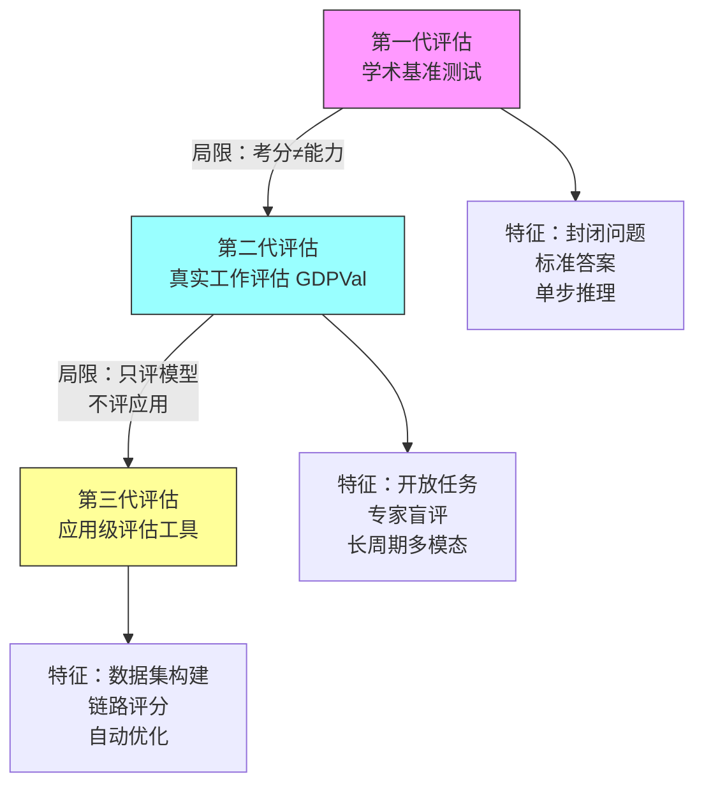

# AI 评估的拐点：从考试分数到真实工作能力

**一句话导读：** 当 AI 模型在标准化测试上接近满分，传统的评测方法就失效了——我们需要一套衡量 AI 做真实工作能力的评估体系，这既是 OpenAI 训练下一代模型的关键信号，也是每一个 AI 应用开发者必须掌握的能力基座。

---

**适合谁看：**

- 正在构建 AI Agent 或多 Agent 系统，需要评估端到端质量的开发者
- 需要向团队或管理层证明 AI 产品可靠性的技术负责人
- 想理解 AI 能力边界到底在哪里、能不能替代真人工作的产品经理
- 负责部署 AI 到金融、医疗等高监管场景的合规或风控人员
- 对 AI 对劳动力市场影响有真正好奇心（不是看标题党那种）的人

---

**读完你会获得什么：**

- 理解为什么学术基准测试（SAT、LSAT 等）已经无法衡量 AI 的真实能力
- 掌握 GDPVal 的设计逻辑——如何用「真实工作任务」替代「标准化考试」来评估模型
- 理解成对专家盲评（pairwise expert grading）的机制，以及为什么它比自动化指标更可靠
- 学会为自己的 AI 应用搭建评估流程：从数据集构建、评分器设计到提示词自动优化
- 能区分「模型在某个任务上得分高」和「模型能替代人做这个工作」之间的本质差异
- 避开评估中最常见的坑：用假设数据、跳过评估直接上线、只看单点不看全链路

---

## 01 背景：为什么这个问题现在值得讨论

一个事实正在改变 AI 行业：**传统评测方法已经到顶了。**

2024 年春天，OpenAI 在训练 GPT-4o 时遇到了一个尴尬局面——SAT、LSAT、AMC（美国高中数学竞赛）这些学术基准测试上，模型已经接近 100% 满分。按考试分数看，模型似乎"什么都会了"。但实际放到真实工作场景中，模型离"能干活"还有很大距离。

这像什么？像招了一个高考状元来公司实习——考试满分，但干活不行。考试成绩和工作能力之间的鸿沟，在 AI 身上同样存在。

问题的本质是：**学术基准测试衡量的是"封闭环境下的解题能力"，而真实工作需要的是"开放环境下的交付能力"。** 前者有标准答案，后者没有；前者是单步推理，后者是多步骤、多模态、长周期的任务链条。

这个鸿沟不填上，模型训练就没有方向——你不知道下一轮训练到底是在进步还是在原地打转。同样，应用开发者也不知道自己的 AI 产品到底靠不靠谱，只能"凭感觉上线"。

---

## 02 核心判断：视频真正想讲的不是"OpenAI 发布了新评测"

表面上看，这个视频在介绍两个东西：GDPVal（OpenAI 的新评测基准）和 Evals 产品（面向开发者的评估工具）。但真正的主线是：

**AI 评估正在经历一次范式转移——从"考分思维"转向"工作交付思维"。**

这个转移影响的不只是 OpenAI 内部的模型训练。它直接影响每一个 AI 应用开发者的工作方式：

- 如果你还在用"模型在 MMLU 上得了多少分"来判断能力，你的判断已经滞后了
- 如果你还在"凭感觉"评估自己的 AI 应用，你无法系统性地改进它
- 如果你还在把评估当成上线前的一道检查而不是开发过程中的持续反馈，你的迭代速度会越来越慢

视频的两个部分（GDPVal 和 Evals 产品）其实是同一个逻辑的两面：**OpenAI 用 GDPVal 来指导自己的模型训练，用 Evals 产品让开发者用同样的逻辑指导自己的应用开发。** 评估不是终点，是反馈回路的核心信号。

---

## 03 概念澄清：先把关键名词讲准确

### 学术基准测试（Academic Benchmarks）

- **是什么：** 标准化的考试题目集，如 SAT、LSAT、AMC、MMLU，有明确的标准答案和评分规则
- **解决什么问题：** 在 AI 能力较低时，提供一个可量化、可比较的能力指标
- **不是什么：** 不是对真实工作能力的衡量。考满分不等于能干活
- **和相关概念的区别：** 和 GDPVal 的核心差异在于"封闭性"——学术测试是封闭问题（有标准答案），真实工作是开放问题（交付质量由人判断）
- **例子：** AMC 数学竞赛题有唯一正确答案；而"为一个房地产项目制作宣传手册"没有唯一答案，质量取决于专业判断

### GDPVal

- **是什么：** OpenAI 构建的、覆盖美国 GDP 主要贡献行业的 1000+ 真实工作任务评测集
- **解决什么问题：** 衡量模型在"经济价值可衡量的真实工作"上的表现，替代学术基准测试
- **不是什么：** 不是在说"AI 替代了所有工作"。它只测量"明确定义输入和输出的具体任务"，不包含任务选择、优先级判断、迭代反馈等真实工作中的开放环节
- **和相关概念的区别：** 和学术基准测试的核心差异是"任务的真实性"——所有任务由各领域平均 14 年经验的专家创建，模拟的是他们日常工作中的交付物
- **例子：** 房地产经纪人基于物业照片和研究资料制作宣传手册；制造业工程师创建 3D 模型；视频剪辑师制作带音频的高能量短片

### 成对专家盲评（Pairwise Expert Grading）

- **是什么：** 将模型的输出和人类专家的交付物同时呈现给领域专家，专家不知道哪个是模型、哪个是人，选择更优的那个
- **解决什么问题：** 消除评分中的偏见（知道是 AI 可能会偏严或偏宽），获得对真实工作质量的判断
- **不是什么：** 不是客观指标（如准确率、F1），它依赖人的主观判断，但通过盲评机制控制了偏见
- **和相关概念的区别：** 和 LLM-as-Judge 不同——LLM-as-Judge 用模型评模型，速度快但有系统性偏差；盲评用人评模型，更可靠但更贵更慢
- **例子：** 两位高血压患者教育材料放在一起，评审者不知道哪个是护士写的、哪个是模型生成的，选更喜欢的那个

### Win Rate（胜率）

- **是什么：** 模型输出被专家偏好选中的比例
- **解决什么问题：** 提供一个直观的、可追踪的能力指标——"模型在多大程度上能替代专业人员的交付"
- **不是什么：** 不等于"替代率"。胜率 40% 不意味着 40% 的工作可以被替代——实际工作中还有沟通、判断、迭代等环节
- **例子：** GPT-4 在 GDPVal 上的胜率不到 20%，即专家 80% 以上的情况更偏好人类输出；GPT-5 接近 40%，即接近一半的情况模型输出被认为和人类专家同等甚至更优

### Trace Grading（链路评分）

- **是什么：** 对 Agent 执行的完整链路（从输入到最终输出中间的每一步）进行评分
- **解决什么问题：** 在多 Agent 系统中，问题可能出现在任何一个中间节点。Trace Grading 帮助定位具体是哪个环节出了问题
- **不是什么：** 不是只看最终输出质量的评分。最终结果好不代表过程没问题，最终结果差也需要知道是哪一步导致的
- **例子：** 一个投资分析 Agent 链路包含"收集数据→基本面分析→批判性审查→生成报告"，如果最终报告质量差，Trace Grading 能定位是数据收集有误还是批判审查环节遗漏了关键风险

---

## 04 整体框架：AI 评估的两次跃迁

视频内容可以理解为 AI 评估体系经历的两次跃迁：

**第一代：学术基准测试。** 封闭问题、标准答案、可自动评分。在 AI 能力较低时有效，但模型接近满分后失效。像用高考分数招人——只能筛掉不合格的，不能保证合格的人真能干活。

**第二代：真实工作评估（GDPVal）。** 用各领域专家创建的真实工作任务替代考题，用成对盲评替代自动评分。衡量的是"模型交付物在多大程度上能达到人类专家的水平"。这是 OpenAI 内部训练模型的核心信号。

**第三代：应用级评估（Evals 产品）。** GDPVal 衡量的是通用模型能力，但每个 AI 应用有自己的特定质量标准。应用级评估让开发者为自己的场景构建评估体系，覆盖从单节点到端到端的完整链路，并通过自动化工具加速迭代。

三次跃迁的驱动力都是同一个：**当上一层评估的天花板被触及，就必须向下一层寻找新的信号。**

---

## 05 关键机制：GDPVal 和应用级评估到底怎么运行

### GDPVal 的运行机制

**输入：** 由各领域专家（平均 14 年行业经验）创建的真实工作任务。每个任务有明确的输入（如物业照片、研究资料）和期望的输出（如宣传手册）。

**任务覆盖范围：** 从美国 GDP 贡献最大的 9 个行业出发（每个行业占 GDP 5% 以上），在每个行业中选取工资贡献最高的 5 个知识型岗位，再覆盖每个岗位的主要工作任务。最终产出 1000+ 个任务，覆盖房地产、CAD 设计、零售等领域。

**评分流程：**

1. 模型执行任务，生成交付物
2. 人类专家执行同一任务，生成交付物
3. 领域评审者在不知道哪个是模型、哪个是人的情况下，选择更优的
4. 统计模型被选中的比例，得到 Win Rate

**为什么这样设计：** 真实工作的质量没有标准答案，只能由人来判断。盲评消除了"知道是 AI 就偏严"或"觉得 AI 神奇就偏宽"的偏见。Win Rate 是一个直观、可追踪、可比较的指标。

**代价：** 贵且慢。每个任务需要专家创建、专家执行、专家盲评，全链路都需要人。无法像学术基准那样快速、大规模地跑。

**适用场景：** 衡量通用模型在真实工作上的能力进展，作为模型训练的北极星指标。不适合日常快速迭代。

### 应用级评估的运行机制

**输入：** 开发者自己的应用场景中的真实数据——用户输入、期望输出、业务约束。

**核心流程（以投资分析 Agent 为例）：**

1. **构建数据集：** 上传一组代表性输入（如几个公司名称）和对应的参考数据（如季度营收 Ground Truth）
2. **运行生成：** 模型基于输入执行任务，生成输出
3. **人工标注：** 领域专家对输出打分、写反馈、甚至改写为"黄金标准答案"
4. **配置评分器：** 设定 LLM Judge 的评分规则（如必须包含优劣势对比、竞品比较、买卖评级，且财务数据与 Ground Truth 一致）
5. **运行评分：** 评分器批量跑过所有生成结果，标注失败案例
6. **自动优化提示词：** 基于失败案例、标注数据和评分器反馈，自动改写提示词
7. **链路评分：** 对完整 Agent 链路的每一步设置评分规则，定位问题节点

**为什么这样设计：** 人工标注贵且不可扩展，评分器便宜但需要和人的偏好对齐。两者结合——用少量人工标注校准评分器，用评分器规模化跑分，用自动优化减少人工调参——形成一个可迭代、可扩展的评估回路。

**代价：** 初始搭建需要投入——构建数据集、定义评分标准、校准评分器。但一旦跑通，后续迭代速度远快于纯人工。

**适用场景：** 任何 AI 应用开发过程中，特别是 Agent 和多 Agent 系统。不是上线前的一道门，而是开发全过程的反馈信号。

---

## 06 方法拆解：为自己的 AI 应用搭建评估体系

### 第一步：构建数据集

- **目标：** 建立一组能代表真实用户输入的测试数据
- **具体动作：** 从历史用户输入中采样，不要自己编造假设场景。每个输入附带参考输出（Ground Truth）如果有的话
- **判断标准：** 数据集覆盖了你应用的主要使用场景和典型边界情况。5-10 条起步就够，不必追求大量
- **常见坑：** 自己想当然编造输入，导致评估集和真实分布偏差巨大
- **产出物：** 一个结构化的数据集，包含输入变量和参考标准列

### 第二步：配置评分器

- **目标：** 定义"什么是好输出"的规则，并让 LLM 按这个规则自动评分
- **具体动作：** 写评分标准（Rubric），明确列出输出必须包含的要素和禁止出现的错误。先人工标注几条，然后用标注结果校准评分器
- **判断标准：** 评分器的判断和人类专家的判断在 80%+ 的情况一致
- **常见坑：** 评分标准写得太笼统（如"输出应该质量高"），导致评分器无法执行。应该写具体到可检查的条目（如"必须包含优劣势分析"、"财务数据必须与参考数据一致"）
- **产出物：** 一个配置好的 LLM Judge，能对生成结果给出通过/失败判定和原因说明

### 第三步：运行评估并分析结果

- **目标：** 发现失败模式，而非只看一个总体分数
- **具体动作：** 批量运行评分器，按失败类型分类（如"缺少竞品对比"、"数据不一致"），找出高频失败模式
- **判断标准：** 你能明确说出"模型最常在哪种情况下失败"以及"失败的具体原因是什么"
- **常见坑：** 只看总体通过率，不看具体失败原因。60% 通过率本身不提供改进方向，但"80% 的失败都是因为缺少竞品对比"提供了明确方向
- **产出物：** 失败模式分类和优先级排序

### 第四步：自动优化提示词

- **目标：** 基于评估结果自动改进提示词，减少手动调参
- **具体动作：** 将原始提示词、失败案例、人工标注、评分器反馈一起输入优化器，生成改进版提示词
- **判断标准：** 改进后的提示词在相同数据集上的通过率显著提升
- **常见坑：** 完全跳过这一步，手动改提示词。手动改对单个案例有效，但难以系统性地覆盖所有失败模式
- **产出物：** 改进后的提示词，附带对比说明（改了什么、为什么改）

### 第五步：端到端链路评分

- **目标：** 评估整个 Agent 链路，而非只看单个节点
- **具体动作：** 在 Agent 链路的每个关键步骤设置评分规则。运行完整链路后，评分器逐节点检查
- **判断标准：** 能定位到"是哪个节点出了问题"，而不只是"最终输出质量差"
- **常见坑：** 只评估最终输出。在多 Agent 系统中，最终结果差可能是任意中间节点的问题，只看终点无法定位根因
- **产出物：** 端到端评估报告，标注每个节点的通过/失败状态

---

## 07 案例讲解：一个投资分析 Agent 的评估全过程

**场景背景：** 一家全球投资机构用多 Agent 系统做投资分析——输入一家公司名称，系统从多个视角（基本面分析、技术面分析等）生成分析报告，经过批判性审查，最终输出一份带买卖评级的投资建议报告。

**遇到的问题：** 系统搭好了，但报告质量不稳定——有时缺少竞品对比，有时财务数据有误，有时没有明确的买卖评级。手动检查每份报告太慢，但不检查又不敢发给投资人。

**按框架如何处理：**

**步骤 1 — 构建数据集：** 选了几个代表性公司作为测试输入，附上这些公司的季度营收和利润 Ground Truth 数据，用于验证模型是否能查到正确的财务数据。

**步骤 2 — 配置评分器：** 设定评分规则——输出必须包含：优劣势论证、竞品对比分析、明确的买卖评级，且财务数据与 Ground Truth 一致。

**步骤 3 — 运行评估：** 发现模型在竞品对比上频繁失败——它分析了公司本身，但没有和同行业竞争对手对比。

**步骤 4 — 自动优化提示词：** 将失败案例和评分反馈输入优化器。原来的提示词只有两行简单指令，优化后的提示词详细列出了所有必须覆盖的分析维度，包括竞品对比的具体要求。

**步骤 5 — 端到端链路评分：** 对完整的 Agent 链路做评估，在"数据收集"节点设置规则检查信息源是否权威（一手来源而非新闻聚合），在"最终输出"节点检查是否有明确评级。发现数据收集节点有时引用了二手来源，这是单看最终输出不容易发现的问题。

**最终结果：** 形成了一个可重复运行的评估流程——改了提示词后在同样数据集上重新跑分，量化改进效果；链路评分帮助持续监控每个节点的健康度。

**说明了什么：** 评估不是一次性的"质检门"，而是持续反馈的开发基础设施。没有它，你在黑暗中摸索；有了它，每一轮改进都有信号告诉你方向对不对。

---

## 08 常见误区

**误区 1：模型在基准测试上分数高 = 模型能力强**

- 错误理解：MMLU 90 分的模型一定比 80 分的模型在工作场景中更强
- 为什么错：学术基准测试衡量的是封闭问题的解题能力，和真实工作中的交付能力是两回事。GPT-4 在学术测试上接近满分，但 GDPVal 上胜率不到 20%
- 正确理解：基准测试分数是能力下界的粗略信号——高分不代表强，但低分一定代表弱
- 应该怎么做：用和你实际场景相关的任务来评估，而不是看通用分数

**误区 2：GDPVal 胜率 40% = 40% 的工作可以被 AI 替代**

- 错误理解：模型在 GDPVal 上胜率 40%，意味着 40% 的岗位会被替代
- 为什么错：GDPVal 衡量的是"明确定义输入输出的具体任务"，不包含真实工作中的任务选择、优先级判断、沟通协调、迭代反馈等环节。一个会计师做预算的某个子任务可以被 AI 做得和专家一样好，不代表会计师这个岗位可以被替代
- 正确理解：胜率衡量的是任务级能力，不是岗位级替代。视频中明确说了这一点
- 应该怎么做：把胜率理解为"AI 辅助完成某个子任务时，输出质量达到专家水平的概率"，而不是"替代概率"

**误区 3：评估是上线前的事，开发阶段不需要**

- 错误理解：先把产品做出来，上线前再跑一次评估确认质量
- 为什么错：没有评估的开发是盲目的——你不知道改了一个提示词到底让系统变好了还是变差了。等到上线前才发现问题，修复成本远高于开发过程中持续评估
- 正确理解：评估应该从开发第一天就存在，作为持续反馈信号，而不是最后一道门
- 应该怎么做：开发初期就定义一组简单评估（哪怕只有 5 条测试用例），每次改动后跑一次

**误区 4：自己编造测试数据就够了**

- 错误理解：我想几个典型场景作为测试输入，应该能代表真实用户
- 为什么错：你对用户使用方式的理解几乎一定有偏差。真实用户会以你意想不到的方式使用系统，边界情况很难靠想象覆盖
- 正确理解：测试数据应该来自真实用户输入的采样，而不是开发者的想象
- 应该怎么做：从历史用户输入中采样。没有历史数据就用 Beta 用户的输入。再不济也要让非开发团队成员提供输入

**误区 5：LLM Judge 不靠谱，还是得靠人**

- 错误理解：用模型评模型不可信，只能全部靠人工评审
- 为什么错：全靠人确实更准，但不可扩展。当你的系统每天处理成千上万条请求时，人工评审只能覆盖极小比例，大量问题会被遗漏
- 正确理解：LLM Judge 需要和人工标注对齐才能可靠。用少量人工标注校准评分器，然后用评分器规模化跑分，是性价比最高的方案
- 应该怎么做：先做人工标注，用标注结果验证和校准 LLM Judge，确认两者一致性达到 80%+ 后大规模使用 LLM Judge

**误区 6：只评估最终输出就够了**

- 错误理解：只要最终输出质量好，中间过程不重要
- 为什么错：在多 Agent 系统中，最终输出质量好可能是偶然——中间某个节点虽然有问题但被后续节点"补救"了。这种"补救"不可靠，下次可能就补不回来。而最终输出差时，只看终点无法定位是哪个环节出了问题
- 正确理解：端到端评估和单节点评估都需要。前者保证系统整体质量，后者帮助定位和预防问题
- 应该怎么做：在 Agent 链路的关键节点都设置评分规则，形成可追溯的评估链

**误区 7：评估集越大越好**

- 错误理解：测试用例越多，评估越可靠
- 为什么错：评估集的价值取决于代表性而非数量。1000 条随机采样不一定比 50 条精心挑选的更能覆盖关键场景。而且大评估集运行成本高，迭代速度慢
- 正确理解：小而精的评估集优于大而散的。5-10 条起步，覆盖主要场景和已知边界情况，随开发逐步扩展
- 应该怎么做：从 5 条开始，确保每条都有明确的评估标准。当发现新的失败模式时再补充对应用例

---

## 09 实战清单

### 立即能做

1. **盘点你当前 AI 项目的评估现状：** 你现在有没有评估流程？如果有，是人工还是自动化？覆盖了单节点还是端到端？写下来。
2. **从历史用户输入中采样 5-10 条，构建最小评估集：** 不要编造，用真实数据。每条附带你对"好输出"的期望描述。
3. **为你的 AI 应用写一份评分标准（Rubric）：** 列出输出必须满足的 3-5 个具体条件（不是"质量高"这种模糊表述，而是"必须包含 X"、"数据必须与 Y 一致"这种可检查的条目）。
4. **用你的评分标准手动评审 5 条生成结果：** 评分标准能不能执行？有没有模棱两可的地方？据此修改标准。
5. **配置一个 LLM Judge：** 把你的评分标准喂给一个模型，让它按标准给输出打分，然后对比它和你的判断是否一致。

### 一周内能做

1. **用少量人工标注校准 LLM Judge：** 人工标注 10-20 条，统计 LLM Judge 和人工判断的一致率。如果低于 80%，修改评分标准中的模糊表述。
2. **对多 Agent 系统做链路评估设计：** 画出你的 Agent 执行流程图，在每个关键节点标注"这个节点的输出应该满足什么条件"。
3. **跑一次端到端评估：** 用你的评估集跑一次完整链路，记录每个节点的通过/失败状态，找出最薄弱的环节。
4. **把评估集成到开发流程中：** 每次修改提示词或系统配置后，自动跑一次评估。不需要 CI/CD 级别的自动化，手动触发也行，但要形成习惯。

### 长期要沉淀

1. **持续扩展评估集：** 每发现一个新的失败模式，就补充对应的测试用例。评估集是活的，不是一次建好就完事的。
2. **定期用人工标注重新校准评分器：** 模型更新后评分器的判断可能漂移，每季度做一次校准检查。
3. **建立评估指标看板：** 追踪核心指标（如通过率、各节点成功率）随时间的变化趋势，不只是看单次结果。
4. **让领域专家参与标注：** 评估的质量上限取决于标注者的专业水平。如果可能，让真正的业务专家而非开发人员做标注。
5. **探索自动优化工具：** 当评估体系基本跑通后，引入提示词自动优化、数据集自动生成等工具，进一步加速迭代。

---

## 10 总结

AI 评估正在经历一次深刻的范式转移。学术基准测试在 AI 能力较低时是有效的导航仪，但当模型在标准化考试上接近满分，这套导航就失效了——它无法告诉你模型在真实工作中到底行不行。

GDPVal 代表了新的方向：用真实工作任务替代考试题目，用专家盲评替代自动评分，用胜率替代准确率。它告诉我们的核心事实是——GPT-4 在真实任务上的胜率不到 20%，GPT-5 接近 40%，趋势在加速，但离替代人类专家还有距离。而且这个距离不是在"解题能力"上，而是在"开放环境下的交付能力"上。

对应用开发者而言，同样需要从"凭感觉上线"转向"用评估驱动迭代"。评估不是质检门，是开发全过程的反馈回路。从 5 条真实数据起步，写具体可执行的评分标准，用人工标注校准自动化评分器，在 Agent 链路的每个关键节点设置检查点——这套方法不复杂，但大多数团队还没开始做。

**那些认真投入评估的团队，会系统性地构建出更可靠的 AI 产品；那些跳过评估的团队，会在模型能力越强时越难发现问题——因为输出"看起来不错"和"真正可用"之间的差距，只有评估能揭示。**
