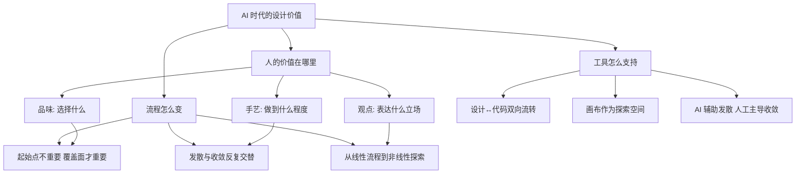

# AI 时代的设计：当执行不再是瓶颈，什么才是核心竞争力？

一句话导读：Figma 创始人 Dylan Field 认为，AI 让设计的"怎么做"变得廉价，但"做什么"和"为什么做"反而更值钱——品味、手艺和观点，正在成为新的分水岭。

适合谁看：
- 正在用 AI 工具做设计/产品，但觉得产出总差一口气的从业者
- 想理解"品味"和"手艺"到底指什么、怎么练的产品经理或设计师
- 团队正在讨论 AI 是否会取代设计岗位的管理者
- 对 Figma 产品方向和设计工具演进感兴趣的技术人员
- 希望在 AI 时代重新定位自身价值的独立开发者

读完你会获得什么：
- 能分清"品味"、"手艺"、"观点"三个常被混用的概念及其各自的作用
- 能理解"发散-收敛"为什么是 AI 时代设计流程的核心，而非线性推进
- 能判断 AI 生成的设计结果该在什么环节介入、什么环节必须人工推进
- 能避开"prompt 即成品"和"AI 全能"两类常见误区
- 能用一套可操作的框架，把自己的设计流程从线性改成探索式
- 能理解 Figma 为什么押注"设计即代码"方向，以及这对从业者意味着什么

---

## 01 背景：为什么这个问题现在值得讨论

AI 模型在视觉生成、代码生成、文案生成上的能力正在快速逼近"可用"的门槛。Gemini 3 等模型在复杂 prompt 下已经能产出视觉上相当不错的界面设计。Vibe Coding 工具让你输入一句话就能生成一个完整的前后端应用。

这对设计行业产生了一个根本性的冲击：**当"做出来"变得容易，"做什么"和"做成什么样"的价值就相对上升了。**

过去的设计流程中，大部分时间和精力花在执行上——画图、调间距、写代码、对齐组件。这些执行层的工作正是 AI 擅长替代的。但设计决策层的问题——"这个产品应该传达什么感觉？""这个布局为什么比那个好？""这个体验到底在解决什么问题？"——AI 并不能替你回答。

Dylan Field 在 2026 年 2 月底的这次对话中，试图回应一个所有人都关心但没人说清楚的问题：**当 AI 把执行层的事情做得越来越快，人的价值到底在哪里？**

他的回答不是"AI 不会取代人"这种安慰话，而是一个更具体的框架：人的价值在三个维度上——品味、手艺、观点——它们各有分工，且都不可被 AI 直接替代。

---

## 02 核心判断：视频真正想讲的不是"AI 会不会取代设计师"

表面上看，这场对话在讨论 AI 对设计行业的影响。但 Dylan Field 真正在讲的是一件事：**设计流程的本质从"线性执行"转向"非线性探索"，而人在这套新流程中的角色，是从执行者变成判断者。**

这个判断包含三个层次：

1. **执行不再是瓶颈**。AI 可以快速生成大量方案，但"哪个方案好"需要人判断。
2. **探索比结论更重要**。过去的设计流程是"想清楚再做"，现在应该是"做出来再想"——快速发散，人工收敛。
3. **工具要适配这个新流程**。Figma 押注的方向（设计↔代码双向流转、无限画布、AI 辅助发散）都是为了支持这个非线性探索流程。

如果只看到"AI 辅助设计"这个表层，就会陷入"prompt 能不能生成好设计"的无意义争论。真正的问题是：**你的设计流程是不是已经从"线性交付"切换到了"探索式迭代"？**

---

## 03 概念澄清：先把关键名词讲准确

### 品味 (Taste)

- **它是什么**：在大量可能性中，清晰地知道"我要什么"和"我不要什么"的能力
- **它解决什么问题**：当选择空间无限大时，帮你缩小搜索范围
- **它不是什么**：不是审美偏好，不是"好看"，不是个人风格
- **它和相关概念的区别**：品味是"选择"的能力，手艺是"做好"的能力，观点是"表达立场"的能力
- **例子**：面对 AI 生成的 20 个界面方案，品味好的人能快速挑出 2 个值得深入的方向，并说清楚另外 18 个为什么不行

### 手艺 (Craft)

- **它是什么**：在所有抽象层级上（从宏观架构到像素细节）都把事情做到位的执着和能力
- **它解决什么问题**：把"方向对"变成"真正好"
- **它不是什么**：不是机械地打磨细节，不是强迫症式的完美主义
- **它和相关概念的区别**：品味决定方向，手艺决定完成度
- **例子**：一个按钮的圆角、间距、动画曲线、响应状态，每一层都精心处理，且各层之间逻辑一致——这就是手艺

### 观点 (Point of View)

- **它是什么**：你对世界应该如何运作的独特判断，并通过产品表达出来
- **它解决什么问题**：让你的产品有立场、有灵魂，而不是"大家都要什么我就做什么"
- **它不是什么**：不是固执己见，不是不听用户反馈
- **它和相关概念的区别**：品味帮你做选择，观点帮你做别人不敢做的选择。如果所有人都同意你的观点，说明你没什么观点
- **例子**：Notion 的观点是"文档和数据库不应该分开"，Linear 的观点是"项目管理工具应该让工程师愿意用"——这些不是用户调研的结果，是创始人的判断

### 发散-收敛 (Divergence-Convergence)

- **它是什么**：先大量探索可能性（发散），再逐步淘汰和聚焦（收敛）的迭代模式
- **它解决什么问题**：避免过早锁定在局部最优解
- **它不是什么**：不是简单的"想很多然后选一个"
- **它和相关概念的区别**：线性流程是 A→B→C，发散-收敛是 A→{A1,A2,A3}→B→{B1,B2}→C，每一步都可能回到上一步
- **例子**：让 AI 生成 5 个不同风格的首页设计（发散），选出 1 个方向后深入调整（收敛），发现方向不对再回到发散阶段

### 设计即代码 (Design as the New Code)

- **它是什么**：设计可以直接提交到生产环境，设计和代码之间没有鸿沟
- **它解决什么问题**：消除"设计稿→开发实现"之间的信息损耗和翻译成本
- **它不是什么**：不是设计师都去写代码，也不是用代码替代设计
- **它和相关概念的区别**：传统流程是"设计→翻译→代码"，设计即代码是"设计就是代码的可视化表达"
- **例子**：在 Figma 中调整一个组件的间距，这个调整直接以 pull request 的形式进入代码仓库

---

## 04 整体框架：这套内容应该如何理解

Dylan Field 的核心思想可以用一个三层框架来理解：

**框架解读**：

这个框架有三个支柱，它们互相支撑：

**人的价值重新定义**：品味、手艺、观点——这三个维度分别回答"选什么"、"做到什么程度"、"为什么这样做"。AI 可以帮你生成选项，但不能替你选；可以帮你打磨细节，但不能替你判断"够不够好"；可以帮你分析数据，但不能替你决定"我们应该站在哪一边"。

**流程从线性变成非线性**：过去的设计流程是"需求→设计→开发→测试"，每个阶段有明确的入口和出口。现在，你可以从任何地方开始——从代码、从画布、从文档、从现有产品——然后在各个阶段之间自由跳转。关键不是从哪里开始，而是你有没有覆盖到所有需要探索的空间。

**工具要适配新流程**：Figma 的产品方向（设计↔代码双向同步、无限画布、AI 辅助）都是为了支持这个非线性探索流程。 Dylan Field 反复强调的一点是：**画布上的直接操作优于 prompt，设计直接操作优于代码编辑，代码编辑优于 prompt**——这不是技术偏好，是对"人应该在哪里介入"的判断。

---

## 05 关键机制：它到底是怎么运行的

### 机制一：品味-手艺-观点的分工协作

**输入**：一个设计问题（比如"重新设计注册流程"）

**处理过程**：
1. **观点**先介入——"我们的立场是什么？注册流程应该极简还是应该收集足够信息？"这决定了探索的方向
2. **品味**在探索中介入——面对 20 个 AI 生成的方案，快速判断哪 2-3 个值得深入
3. **手艺**在收敛后介入——选定方向后，从宏观架构到像素细节，每一层都推到足够好

**输出**：一个有立场、有判断、有完成度的设计

**为什么这样设计**：三个能力各有盲区。只有品味没有手艺，方向对但做不出来；只有手艺没有观点，做得很精致但没灵魂；只有观点没有品味，有想法但选不出路径。

**代价**：这三者很难同时很强。大多数人需要团队协作来补齐。

**适合场景**：有明确设计目标的团队。不适合没有立场、纯粹"用户要什么就做什么"的项目。

### 机制二：非线性探索流程

**输入**：一个模糊的产品想法

**处理过程**：
1. 从任意起点开始（代码、画布、文档、现有产品）
2. 快速做一个"桩"（stake in the ground）——不需要完美，但需要可见
3. 看到实物后，判断方向对不对
4. 如果对，进入收敛——深入打磨
5. 如果不对，回到发散——换方向再试
6. 发散和收敛不是一次性的，而是反复交替（"钻石形状叠在一起"）

**输出**：一个经过充分探索、方向明确的产品方案

**为什么这样设计**：Dylan Field 举了一个内部例子——设计师展示了大量概念探索，但被要求"只做前三分之一，先做出来去学"。因为在没有实物的情况下，再多探索也只是"可能性"，不是"知识"。只有做出来、用起来，才能真正学到东西。

**代价**：比线性流程更难管理。团队需要容忍模糊性，管理者需要接受"不确定方向"的阶段。

**适合场景**：探索性产品、新功能设计。不适合改动影响面很大的核心功能（Dylan Field 明确说，如果是 Figma 的核心体验变更，他必须亲自看）。

### 机制三：设计↔代码双向流转

**输入**：设计师在 Figma 上的设计稿，或开发者在代码中的实现

**处理过程**：
1. 从代码开始：开发者直接写代码搭原型，在代码中调整间距和布局不够直观
2. 跳到画布：将代码中的组件同步到 Figma，用直接操作调整视觉属性
3. 回到代码：画布上的调整自动同步回代码，形成 pull request
4. 反向同样成立：从设计稿到代码，保持一致性

**输出**：设计和代码始终同步，没有"翻译损耗"

**为什么这样设计**：Dylan Field 的判断是——**直接操作 > 代码编辑 > prompt**。对于调整间距、布局、视觉属性这类工作，画布上的直接操作比写代码或写 prompt 都更高效。但对于逻辑、状态管理这类工作，代码仍然是更好的载体。

**代价**：双向同步的技术实现极难，目前质量还在持续提升中。

**适合场景**：设计和开发紧密协作的团队。不适合设计和开发完全分离的组织。

---

## 06 方法拆解：如果自己要做，应该怎么落地

### 步骤一：建立你的"观点文档"

**目标**：明确你和你的产品到底站在什么立场上

**具体动作**：
- 写下 3 条你认为是真理但别人可能不认同的产品判断
- 每条判断后面写上"为什么"和"如果反过来会怎样"
- 和团队讨论：哪些是我们真正坚持的？哪些只是习惯？

**判断标准**：如果你的观点所有人都同意，说明它不是观点，是常识

**常见坑**：把"用户调研结果"当观点。调研告诉你现状，观点告诉你方向

**产出物**：一页纸的"产品立场声明"

### 步骤二：改造设计流程——把线性改成探索式

**目标**：让团队习惯"先发散再收敛"的工作方式

**具体动作**：
- 在下一个设计任务中，强制要求先产出 5 个以上方向不同的方案（不要求完成度，只要求差异化）
- 用 AI 工具辅助发散阶段（生成多个风格/布局/流程的变体）
- 评审时只讨论"哪个方向对"，不讨论"哪个做得好"
- 选定方向后再进入手艺阶段的打磨

**判断标准**：如果评审会上所有人都没有分歧，说明发散不够

**常见坑**：在发散阶段就追求完成度。Dylan Field 的建议是——"做到三分之一就够了，做出来去学"

**产出物**：一个经过充分发散后收敛的方向选择，以及选择理由

### 步骤三：用 AI 做起始点，不做终点

**目标**：正确地把 AI 嵌入设计流程

**具体动作**：
- 用 AI 生成第一版方案（文案、布局、视觉风格都可以）
- 把 AI 输出当作"陈词滥调检测器"——它给你的通常是"最显而易见的做法"
- 基于这些显而易见的做法，明确你要"和它不同在哪里"
- 然后用手艺和品味去推进到你想去的地方

**判断标准**：如果你直接用了 AI 的输出，说明你还没有观点

**常见坑**：在 prompt 生成后直接交付。Dylan Field 的原话："把 prompt 的输出当作最终结果，是一个错误"

**产出物**：一个"AI 起步 → 人工推进"的完整设计，附带说明你在哪些地方改了 AI 的输出、为什么改

### 步骤四：缩短用户反馈回路

**目标**：减少内部评审轮次，更快接触真实用户

**具体动作**：
- 审视当前流程：从设计完成到用户看到，隔了多少轮内部评审？
- 尝试"5 个原型方案直接给用户看"的方式——用户不会因为你展示了多个方案就觉得你承诺了所有方向
- 区分"必须看"和"可以不看"：核心体验变更需要把关，小改动可以直接上

**判断标准**：如果团队学到东西的速度在加快，说明回路在缩短

**常见坑**：把 CEO/管理者变成瓶颈。Dylan Field 说，"如果你要让一个人看所有东西，你就走不快"

**产出物**：一个更短的用户反馈流程，以及"哪些变更必须过评审"的明确清单

### 步骤五：在团队中扩散"做东西"的能力

**目标**：让非设计师也能参与设计，让非工程师也能参与构建

**具体动作**：
- PM 用 Figma 直接做原型，而不是写文档
- 研究员用原型表达发现，而不是写报告
- 销售用内部工具解决客户问题，而不是提需求
- 用 AI 降低"做东西"的门槛

**判断标准**：如果团队中 60% 的设计产出不是来自专业设计师，说明"做东西"在扩散

**常见坑**：觉得"非专业人士做的不好就不该做"。Dylan Field 的观点是——"领导者在做东西，这才是真正激励团队的"

**产出物**：团队中至少 2 个非设计角色开始用工具直接做原型

---

## 07 案例讲解：用一个具体场景串起来

**场景**：你是一个 SaaS 产品的 PM，需要重新设计用户注册流程。当前注册转化率只有 30%，团队认为流程太长是主要原因。

**遇到的问题**：
- 团队内部有两种声音：一种认为应该极简到只需邮箱，一种认为应该收集足够信息才能做个性化
- 设计师已经做了两版方案，但两版都像"别人家的注册页"，没有独特性
- 开发团队在等设计定稿，但设计方向迟迟不定

**按框架如何处理**：

**第一步：建立观点**。写下产品立场："我们的产品需要用户在注册时就理解核心价值，所以注册不是门槛，是第一次产品体验。"这个观点决定了——我们不追求"极简注册"，而是追求"有价值的注册"。

**第二步：发散**。用 AI 生成 8 个不同方向的注册流程：极简式、引导式、游戏化、社交登录优先、渐进式、价值展示式……每个方向只做草图级别，不追求完成度。

**第三步：用品味收敛**。在 8 个方案中，基于观点快速排除明显不符合的（极简式——不展示价值；游戏化——和产品调性不符），留下 3 个值得深入的。

**第四步：做出来去学**。Dylan Field 的建议——"只做三分之一"。选定"价值展示式"方向，快速做一个可点击的原型，不追求视觉完美，但要让用户能走完流程。

**第五步：接触用户**。拿这个原型去找 5 个目标用户，看他们能不能在注册过程中感受到产品价值。根据反馈调整方向。

**第六步：手艺打磨**。方向确认后，设计师在每一层——信息架构、文案、间距、动画——都推到足够好。

**最终结果**：注册流程既有方向感（因为观点先行），又有差异化（因为充分发散），又有完成度（因为手艺收尾）。

**说明了什么**：AI 时代的设计不是"AI 替你做设计"，而是"AI 帮你快速探索，你负责判断和推进"。整个流程中，AI 只在发散阶段介入，观点、品味、手艺都是人的工作。

---

## 08 常见误区：很多人会在哪里理解错

**误区一：把 AI 输出当最终结果**

- 错误理解：prompt 生成的设计可以直接用
- 为什么错：AI 给你的是"最可能的输出"，也就是最陈词滥调的版本。它解决了"从零到一"的问题，但"从一到好"必须人来
- 正确理解：AI 输出是探索的起点，不是终点
- 应该怎么做：永远在 AI 输出基础上再推进一步，问自己"我要和它不同在哪里"

**误区二：认为"品味"就是"审美"**

- 错误理解：品味好 = 知道什么好看
- 为什么错：品味是判断力，不是审美。品味是在可能性空间中导航的能力，包括判断"什么不该做"
- 正确理解：品味 = 清晰的偏好 + 能说清楚为什么
- 应该怎么做：练习"拒绝"——每次看到方案，不只说"我要哪个"，还要说"我不要哪个，为什么"

**误区三：把"观点"和"固执"混为一谈**

- 错误理解：有观点 = 不听用户意见
- 为什么错：Dylan Field 明确说，听用户意见能帮你找到局部最优解，但观点帮你找到下一个全局最优解
- 正确理解：观点 = 在用户反馈之上，加上你自己的判断
- 应该怎么做：收集用户反馈，但不要让用户定义你的产品方向

**误区四：认为 AI 时代设计师不需要学代码**

- 错误理解：AI 会写代码，设计师不需要懂
- 为什么错：设计和代码之间的双向流转是趋势。不懂代码的设计师，无法判断 AI 生成的代码是否合理，也无法在代码层面推动设计
- 正确理解：不需要精通代码，但需要理解代码的逻辑和约束
- 应该怎么做：至少能读懂 AI 生成的代码，能判断哪些设计调整在代码层面是简单的、哪些是复杂的

**误区五：认为设计流程还是线性的**

- 错误理解：需求→设计→开发→测试，还是这个顺序
- 为什么错：现在你可以从任何地方开始，也可以在任何阶段之间跳转。线性流程假设"想清楚再做"，但实际是"做出来才能想清楚"
- 正确理解：流程是非线性的——发散和收敛反复交替，起点不重要，覆盖面才重要
- 应该怎么做：审视你的流程，找到"我们是不是在某个阶段卡住了"的瓶颈，然后尝试从其他阶段绕过去

**误区六：认为"所有人都会变成全栈"**

- 错误理解：AI 时代，每个人都能做设计+开发+产品
- 为什么错：Dylan Field 观察到，真正发生的是"责任合并"而非"角色合并"——更多人承担多种责任，但仍然在一个领域有专长
- 正确理解：专长仍然重要，但边界在模糊
- 应该怎么做：保持一个核心专长，但培养跨领域的基础能力

**误区七：认为结构化（设计系统/组件库）和创造力是对立的**

- 错误理解：设计系统限制了创造力
- 为什么错：结构化是效率工具，不是创造力的敌人。问题在于你能不能在需要自由时脱离结构、在需要效率时回到结构
- 正确理解：理想状态是能自由进出结构——想自由发挥时忽略 Auto Layout，想规范化时重新应用
- 应该怎么做：把设计系统当作"默认选项"而非"强制约束"，在探索阶段允许脱离

---

## 09 实战清单：读完后可以马上照着做

**立即能做**

1. 写下你产品的 3 条核心观点——那些"你相信但别人可能不同意"的判断
2. 检查你当前的设计流程：从完成到用户看到，隔了多少轮内部评审？找到可以砍掉的环节
3. 下次用 AI 生成设计时，强制要求自己在输出上至少再做 3 轮人工迭代，记录每次改动的原因
4. 拿你最近的一个设计决策，问自己：这是"品味选择"还是"习惯选择"？

**一周内能做**

1. 选一个小功能，用"5 个方案→快速收敛→做到 1/3 就去测试"的方式重新做一遍
2. 找 3 个目标用户，直接展示你早期的原型（不完美也没关系），收集反馈
3. 尝试从代码开始做设计：直接用代码搭一个原型，然后跳到画布上调整视觉，再回到代码
4. 和团队讨论：哪些变更必须过评审，哪些可以直接上？写一个明确清单

**长期要沉淀**

1. 建立你的"品味档案"：每次做设计选择时记录"选了什么、没选什么、为什么"，定期回顾
2. 练习手艺：选一个你经常用的组件，从宏观到微观每一层都推到极致
3. 在团队中培养"做东西"的文化：让 PM、研究员、销售都能用工具直接做原型
4. 持续跟踪 AI 在设计领域的进展，但始终问自己："这个能力是在帮我发散，还是在帮我收敛？我需要的是哪个？"

---

## 10 总结：把全文收束成一个判断

Dylan Field 不是一个"AI 会取代一切"的悲观派，也不是一个"AI 无所不能"的乐观派。他的立场更精确：**AI 改变了设计中"执行"的成本结构，但没有改变"判断"的价值结构。**

品味、手艺、观点——这三个维度不是 AI 时代的发明，但 AI 时代让它们变得更重要了。因为当 AI 能在几秒内生成 20 个方案时，"能做出来"不再是竞争优势，"能选出对的"和"能推到极致"才是。

设计流程也在因此改变。线性流程的假设是"想清楚再做"，但现实是"做出来才能想清楚"。发散和收敛不再是按顺序走的流水线，而是反复交替的探索模式。AI 在发散阶段是强大的助手，但在收敛阶段，人必须主导。

工具的方向也在印证这个判断。Figma 押注的不是"AI 帮你做设计"，而是"让设计↔代码的双向流转尽可能流畅，让画布成为探索空间"。因为 Dylan Field 的核心判断是：直接操作优于 prompt，画布优于代码编辑——人应该在最直观的界面上做判断，而不是在翻译层上做执行。

**一句话判断：AI 让"做"变得廉价，但"选"和"推"变得更贵。在这个世界里，有品味、有手艺、有观点的人，会比以往任何时候都更有价值。**
