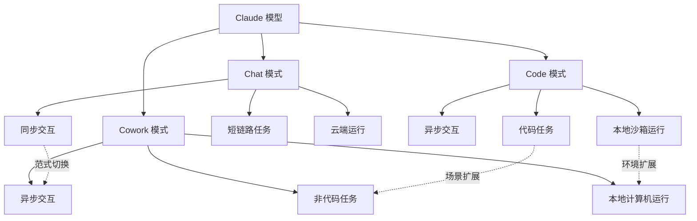

# Claude Cowork：从「聊天式AI」到「异步任务代理」，一次交互范式的根本切换

---

# 一句话导读

Claude Cowork 把 AI 使用模式从「我问你答、等两分钟拿结果」切换到「我交给你做、过会儿来收货」，这不仅是产品更新，而是非技术用户第一次真正进入异步代理工作流。

---

# 适合谁看

- 每天用 Claude/ChatGPT 做研究、写文档，但总觉得「一轮对话只能做一件事」的人
- 想理解 Agent 原生应用设计原则的产品经理和独立开发者
- 带团队的管理者，想评估非技术人员能否用上 Agent 工具
- 已经在用 Claude Code 写代码，好奇「非代码场景」会怎么演化的技术人
- 内容创作者和研究者，需要 AI 做长链路任务（竞品分析、数据采集、文档整理）

---

# 读完你会获得什么

- 分清「聊天」「代码代理」「协作代理」三种 AI 使用模式的本质区别
- 理解为什么异步代理是 AI 交互的下一个范式，以及它对工作方式的冲击
- 掌握 Agent 原生应用的四个核心设计原则（对等性、细粒度、可组合性、涌现能力）
- 知道 Skill 是什么、为什么它比传统 MCP 工具更适合做可复用的代理能力封装
- 能判断自己手头的任务适合用 Chat、Code 还是 Cowork 来完成
- 避开从「聊天思维」切换到「代理思维」时的 5 个常见误区

---

# 正文

## 01 背景：为什么这个问题现在值得讨论

过去两年，大多数非技术用户和 AI 的交互方式没有本质变化：打开聊天框，输入问题，等一两分钟拿到回复，然后继续追问。一轮对话做一件事，做完再做下一件。

这个模式有一个硬限制：**你必须在场**。AI 在回答的时候，你不能让它做别的事；你想让它调整方向，必须等它说完才能插话。

与此同时，开发者在 Claude Code 里已经进入了完全不同的工作模式——启动一个任务，Agent 自己跑几十分钟甚至更久，你中途可以追加指令、检查进度，最后回来验收结果。这是异步的、并行的、不需要你全程盯着的。

问题来了：**这种异步代理模式，为什么只有开发者能用？**

非技术用户的需求——竞品调研、日历审计、邮件起草、数据分析——同样需要长时间运行、多步骤执行、中途可干预。但现有的聊天界面把所有人锁在了同步模式里。

Claude Cowork 就是 Anthropic 对这个问题的回答：把 Claude Code 的异步代理能力，用一个非技术用户能理解的界面交付出来。

---

## 02 核心判断：视频真正想讲的不是「又一个新功能」

视频表面在演示一个新产品，但真正值得理解的是它背后的判断：

**AI 交互的下一个范式切换不是模型变聪明，而是用户从「同步等待」转向「异步委托」。**

这个切换的难度不在于技术——Cowork 底层就是 Claude Code 套了一层 UI。难度在于**心智模型**。习惯了「我问你答」的人，需要学会把任务拆成可委托的单元，学会放手让 Agent 自己跑，学会在合适的时间点回来检查和修正。

Anthropic 把 Cowork 做成独立 Tab 而不是 Chat 里的一个模式，核心原因就是：**你需要一个不同的界面来提醒自己进入不同的心智模式。**这不是功能分区，是认知切换。

---

## 03 概念澄清：先把关键名词讲准确

### 同步聊天模式（Chat）

- **它是什么**：你发一条消息，AI 回一条，一来一回，你全程在场等待
- **它解决什么问题**：快速问答、短链路任务
- **它不是什么**：它不是 AI 的唯一使用方式，也不是所有任务的最佳交互模式
- **和相关概念的区别**：Chat 是同步的、短时的；Cowork 是异步的、长时的
- **例子**：问 Claude「这段话有没有语法错误」——两秒出结果，这就是 Chat 场景

### 异步代理模式（Cowork）

- **它是什么**：你给 Agent 一个任务，它自己跑几十分钟甚至更久，中途你可以追加指令或检查进度，最后回来验收
- **它解决什么问题**：长链路、多步骤、需要反复迭代的任务
- **它不是什么**：它不是「更强版的 Chat」，它需要不同的使用方式
- **和相关概念的区别**：和 Claude Code 共享底层技术，但面向非技术用户；和 Chat 的区别是交互模式而非模型能力
- **例子**：让 Agent「分析过去一个月的日历，看看时间分配是否符合我的优先级」——它需要浏览几十个日程、交叉比对、形成判断，这就是 Cowork 场景

### Skill（技能）

- **它是什么**：一段 Markdown 格式的指令文件，描述了 Agent 在特定场景下应该遵循的规则、风格和步骤。可以包含对脚本或二进制工具的调用
- **它解决什么问题**：把可复用的能力封装成可分享、可迭代的单元，避免每次都从头写 prompt
- **它不是什么**：它不是传统意义上的 MCP 工具（MCP 是固定接口，Skill 是灵活指令）；也不是简单的 system prompt（Skill 可以调用脚本、有条件分支、能被多人共享）
- **和相关概念的区别**：MCP 工具是确定性的函数调用；Skill 是半确定性的工作流模板，包含判断和风格
- **例子**：「Swiss Design Skill」告诉 Agent 所有设计必须遵循瑞士平面设计风格——无衬线字体、网格系统、极简配色。每次调用这个 Skill，Agent 都会按这个风格输出

### Agent 原生架构（Agent-Native Architecture）

- **它是什么**：应用的最底层不是确定性规则代码，而是一个 Agent，UI 的每个操作都转化为对 Agent 的 prompt
- **它解决什么问题**：让应用具备涌现能力——用户能做出开发者没预见到的操作组合
- **它不是什么**：它不是「在应用里加个聊天框」，而是把 Agent 作为应用的核心引擎
- **和相关概念的区别**：传统应用是 UI → 确定性逻辑 → 输出；Agent 原生应用是 UI → Agent 理解+推理 → 输出
- **例子**：Cowork 里你提到一个文件夹名字，Agent 自动判断你需要访问那个文件夹并触发文件选择器——这不是开发者硬编码的，而是 Agent 理解意图后自主操作的

---

## 04 整体框架：这套内容应该如何理解

Claude 的三种模式不是三个产品，而是同一个模型在三种不同交互范式下的三种用法。理解它们的关系，是理解 Cowork 价值的前提。

**核心框架：三层分离**

1. **模型层**：三个模式用的是同一个模型，能力没有差异
2. **交互层**：Chat 是同步的，Code 和 Cowork 是异步的——这是最关键的区别
3. **环境层**：Chat 运行在云端，Code 运行在本地沙箱，Cowork 运行在你的整个计算机上

这个框架解释了为什么 Cowork 值得独立存在：**它同时完成了两个扩展——把异步交互从开发者扩展到所有人，把运行环境从沙箱扩展到你的整台电脑。**

---

## 05 关键机制：它到底是怎么运行的

### 机制一：异步任务循环

- **输入**：你描述一个任务（比如「分析我的竞品定位」）
- **中间处理**：Agent 自主拆解任务 → 多轮浏览器操作/文件读取/数据分析 → 每一步都可以被你中途追加的指令修正
- **输出**：一份完整的分析文档
- **为什么这样设计**：长链路任务不可能在一两个回合完成，Agent 需要自主迭代的能力
- **代价**：你无法精确控制每一步，Agent 可能走偏；你需要学会在关键节点检查而不是全程监控
- **适合**：研究、分析、文档生成、数据采集等需要多步骤推理的任务
- **不适合**：需要精确控制每一步输出的场景（比如填表、翻译特定段落）

### 机制二：中途追加指令（Add to Queue）

- **输入**：Agent 正在运行时，你输入新消息
- **中间处理**：Agent 评估新消息——如果当前任务可以立即调整方向就立即响应，如果当前步骤需要完成后才能处理就排队等待
- **输出**：Agent 在合适的时机整合新指令
- **为什么这样设计**：这是异步模式的核心体验差异。Chat 里你必须等 AI 回完才能说话；Cowork 里你随时可以补充方向
- **代价**：如果指令冲突（先说「往东」又说「往西」），Agent 可能混乱；队列的优先级逻辑对用户不透明
- **适合**：需要边看边调整的探索性任务
- **不适合**：需要严格顺序执行的流程

### 机制三：Skill 加载与执行

- **输入**：用户在任务中提及某个 Skill（或 Agent 自动匹配已安装 Skill）
- **中间处理**：Skill 文件被注入 Agent 的上下文 → Agent 按照 Skill 中的规则和风格工作 → 如果 Skill 引用了脚本，Agent 会调用执行
- **输出**：符合 Skill 规范的结果（特定格式的文档、特定风格的设计、特定流程的分析）
- **为什么这样设计**：Skill 解决了「可复用能力」的问题。不靠硬编码工具，而是靠自然语言指令 + 可选脚本，让 Agent 的能力可以被用户自己定义和分享
- **代价**：Skill 的质量高度依赖编写者的表达能力；Skill 之间可能冲突；没有标准化验证机制
- **适合**：有明确风格要求或重复流程的工作（品牌文案、设计规范、代码审查清单）
- **不适合**：一次性的、没有复用价值的任务

### 机制四：本地计算机访问

- **输入**：用户授权 Agent 访问特定文件夹或应用
- **中间处理**：Agent 通过计算机控制能力（类似 Claude Code 的 computer use）操作你的浏览器、文件系统、桌面应用
- **输出**：Agent 直接在你的环境里完成任务（在 Google Docs 里修改文档、在浏览器里采集数据、在文件系统里整理文件）
- **为什么这样设计**：非代码任务的数据和工具散落在各种应用里，不在 API 后面。只有直接操作计算机才能触达这些数据
- **代价**：安全风险——Agent 有误操作的可能；权限管理粗糙——目前只能按文件夹授权，没有细粒度控制
- **适合**：数据在网页应用里（Gmail、Google Calendar、PostHog）、需要操作桌面软件的场景
- **不适合**：涉及敏感数据或不可逆操作的场景（除非你全程监控）

---

## 06 方法拆解：如果自己要用，应该怎么上手

### 第一步：心智切换——从「提问」到「委托」

**目标**：改变你给 AI 下指令的方式

**具体动作**：
- 把「帮我查一下 X」改成「花 30 分钟彻底研究 X，给我一份完整报告」
- 把「这段话有什么问题」改成「按我们团队的文案规范，审查这份文档并直接修改」
- 关键区别：**设定时间预期 + 设定输出标准 + 允许 Agent 自主规划路径**

**判断标准**：如果你发现自己还在等 Agent 两分钟内回完，说明你还在 Chat 模式

**常见坑**：给了太模糊的指令（「帮我研究一下」），Agent 会跑偏或停在浅层

**产出物**：一个清晰的任务描述，包含目标、输出格式、时间预期

### 第二步：开启 Chrome 连接器

**目标**：让 Agent 能操作你的浏览器

**具体动作**：
1. 打开 Claude 设置 → 连接器 → 启用 Chrome 控制
2. 确保你常用的工作应用（Gmail、Google Docs、Notion 等）在 Chrome 里已登录
3. 给 Agent 一个简单的浏览器任务测试（比如「打开我的 Gmail，找最近一封来自 X 的邮件」）

**判断标准**：Agent 能成功打开 Chrome 并在已登录的应用里操作

**常见坑**：没登录的应用 Agent 也进不去；有些网站的反自动化检测可能阻断操作

**产出物**：一个可用的浏览器通道

### 第三步：选择第一个真实任务

**目标**：用 Cowork 完成一件你本来要自己做 30 分钟以上的事

**具体动作**：
- 从以下类型中选择：竞品调研、日历/邮件审计、文档整理、数据采集
- 写清楚：你要什么结果、结果用什么格式、有没有特定的风格要求
- 启动任务后，**不要盯屏幕**。去做别的事，5-10 分钟后回来看进度

**判断标准**：你回来时，Agent 有实质进展，不是卡在某个权限弹窗上

**常见坑**：选了太简单的任务（一句话能回答的问题），感觉不到 Cowork 和 Chat 的区别；选了太复杂的任务（涉及 5 个以上应用的协作），Agent 会频繁出错

**产出物**：一份 Agent 生成的、你真正会用的产出物（调研报告、邮件草稿、整理好的文件）

### 第四步：创建你的第一个 Skill

**目标**：把你在 Cowork 里反复使用的指令模式固化下来

**具体动作**：
1. 找到你在 Cowork 里给 Agent 写过最长的、最详细的指令
2. 把它提炼成 Markdown 格式的 Skill 文件
3. Skill 包含：目标描述、规则清单、风格要求、输出格式、边界条件
4. 放到 Claude 的 Skills 目录下

**判断标准**：下次调用这个 Skill 时，不需要再补充任何额外指令，Agent 就能按你的预期工作

**常见坑**：Skill 写得太抽象（「写好文章」），Agent 无法执行；写得太死板（每句话该怎么写），失去了 Agent 的灵活性

**产出物**：一个 .md 格式的 Skill 文件

### 第五步：建立异步工作习惯

**目标**：把 Cowork 变成日常工作流的一部分

**具体动作**：
- 每天早上，把当天要做的 2-3 个研究/分析/文档任务交给 Cowork
- 在 Agent 工作时做其他事，定期检查进度和追加方向
- 下班前验收所有任务结果

**判断标准**：你每天有至少 1 小时的工作被 Agent 替代，而你用这小时做了更高价值的判断和决策

**常见坑**：花太多时间监控 Agent 的每一步——这违背了异步委托的初衷

**产出物**：一套适合你工作节奏的 Agent 任务队列

---

## 07 案例讲解：用一个具体场景串起来

**场景背景**：你是一家咨询公司的合伙人，明天有一个晚宴，主办方问你打算谈什么话题。你需要从邮件里找到之前的沟通记录，基于你的研究方向和风格，起草一份回复。

**遇到的问题**：
- 邮件在 Gmail 里，你的研究方向散落在多个文档和日历事件里
- 如果用 Chat，你需要自己把所有相关信息复制粘贴进去，而且 Chat 无法主动去翻你的邮件
- 如果手动写，至少要 20 分钟翻邮件 + 15 分钟起草

**按框架如何处理**：这是一个典型的「长链路 + 多数据源 + 需要理解个人风格」的任务，适合 Cowork。

**每步怎么做**：

1. **委托任务**：「去我的 Gmail 找到主办方 X 发来的晚宴邀请邮件，阅读我的研究方向和最近的工作重心（可以看我的日历和最近文档），然后用我的语气起草一份回复，说明我打算在晚宴上聊什么话题。」

2. **Agent 自主执行**：Agent 打开 Chrome → 进入 Gmail → 搜索相关邮件 → 阅读邮件内容 → 打开日历了解你的近期重点 → 综合判断你的风格和关注点 → 生成回复草稿

3. **中途追加**：Agent 工作到一半时，你想起应该强调某个特定项目，于是追加一句：「记得提一下我们上个月发布的 Agent 原生架构报告」

4. **验收结果**：Agent 生成了一份回复，语气和你一致，内容基于你的实际研究方向，包含了你追加的项目。你只需做 2-3 处微调即可发送。

**最终结果**：一份可以直接发送的邮件回复，你的投入时间从 35 分钟降到 5 分钟（主要是验收和微调）。

**说明了什么**：这个任务的关键不是「AI 能不能写邮件」，而是**AI 能不能自己找到写邮件需要的所有上下文**。Chat 做不到——它没有你的邮件、日历、文件。Cowork 做得到——因为它运行在你的计算机上，能操作你的浏览器和应用。

---

## 08 常见误区：很多人会在哪里理解错

### 误区一：「Cowork 就是更强版的 Chat」

- **错误理解**：以为 Cowork 只是 Chat 换了个界面，回答更详细而已
- **为什么错**：两者的核心区别不是输出质量，而是**交互模式**。Chat 是同步的你来我往；Cowork 是异步的任务委托。如果你还在一问一答地用 Cowork，你完全没有发挥它的价值
- **正确理解**：Cowork 是让 AI 做一个「可以自己跑很久的助手」，不是「回答更长的聊天机器人」
- **应该怎么做**：给 Cowork 的任务，应该是一个你本来要花 20 分钟以上自己做的事，而不是一个一句话能回答的问题

### 误区二：「Cowork 和 Claude Code 是两个不同的产品」

- **错误理解**：以为 Cowork 有独立的技术栈和模型
- **为什么错**：Cowork 底层就是 Claude Code 的 Agent harness，只是 UI 和交互面向非技术用户做了重新设计。错误信息里甚至直接暴露了 Cloud Code 的内部报错
- **正确理解**：它们是同一个引擎的两种驾驶模式——手动挡（Code）和自动挡（Cowork）
- **应该怎么做**：如果你已经会用 Claude Code，Cowork 不会给你新能力；但如果你是非技术用户，Cowork 是你第一次能触达这个引擎

### 误区三：「异步就是不用管了」

- **错误理解**：以为把任务交给 Agent 就可以完全不管，等它出最终结果
- **为什么错**：Agent 会走偏、会卡住、会在错误的方向上越走越远。异步委托 ≠ 不监督
- **正确理解**：异步意味着你不需要**全程盯着**，但需要在**关键节点检查**。就像你把任务交给一个实习生——你不用站在他背后看他打字，但你需要在他开始前说清楚要求，在他做完初稿后审一遍
- **应该怎么做**：每隔 5-10 分钟扫一眼 Agent 的进度，发现方向偏差立即追加修正指令

### 误区四：「Skill 就是高级版的 System Prompt」

- **错误理解**：以为 Skill 只是把 system prompt 存成文件，没什么新东西
- **为什么错**：Skill 和 system prompt 有两个关键区别：一是 Skill 可以调用本地脚本和二进制工具，不只是语言指令；二是 Skill 是可分享、可迭代的独立文件，不是埋在应用设置里的配置
- **正确理解**：Skill 是 Agent 的「可插拔能力模块」，介于纯语言指令（prompt）和确定性接口（MCP tool）之间
- **应该怎么做**：把你在 Cowork 里反复使用的、有明确规范的工作流写成 Skill，而不是每次都从头写长 prompt

### 误区五：「AI 已经能完全自主工作了」

- **错误理解**：看了 demo 以为 AI 可以完全自主完成任何任务
- **为什么错**：Demo 里展示的 Google Docs 逐条修改任务，Agent 在几十分钟的操作中只成功修改了几处，而且很多操作是低效的（用查找替换而不是直接编辑）。Agent 的自主能力还远不到「交付即用」的水平
- **正确理解**：当前 Agent 的能力是「能做但粗糙」——它能跑完全程，但结果需要人类审查和修正
- **应该怎么做**：把 Agent 当作一个能干但没有经验的实习生——它能大幅减少你的工作量，但你必须做最后的把关

### 误区六：「Chat 和 Cowork 应该合并成一个界面」

- **错误理解**：觉得分两个 Tab 是产品设计的冗余
- **为什么错**：Anthropic 把 Cowork 做成独立 Tab 的核心原因是**心智模式切换**。同一个界面里，人会惯性使用熟悉的模式。独立 Tab 强制你意识到：你在用不同的方式工作
- **正确理解**：界面分离是认知工具，不是功能分区。就像厨房和餐厅在同一个房子里，但你不会在餐桌上炒菜
- **应该怎么做**：接受这种分离，把它当作提醒——点开 Cowork Tab 时，提醒自己「我要委托一个任务，不是问一个问题」

---

## 09 实战清单：读完后可以马上照着做

### 立即能做

- [ ] 打开 Claude 桌面应用，找到 Cowork Tab，确认它已可用
- [ ] 在设置里启用 Chrome 连接器，确保常用工作应用（Gmail、Google Docs 等）在 Chrome 中已登录
- [ ] 用 Cowork 做一件你本来要自己做 15 分钟以上的事，比如「整理我下载文件夹里最近一周的文件，按项目分类」
- [ ] 把你给 Cowork 写的第一个指令保存下来，观察它和你在 Chat 里写的指令有什么不同

### 一周内能做

- [ ] 选一个你每周重复做的研究/分析/整理任务，用 Cowork 完整跑一遍，对比用时和质量
- [ ] 创建你的第一个 Skill——把你在 Cowork 里写过的最详细的指令提炼成 .md 文件
- [ ] 测试一个浏览器任务：让 Agent 去 PostHog/Google Analytics/任何你用的数据平台，提取一个你需要的数据指标
- [ ] 记录这一周里 Cowork 成功完成的任务和失败的任务，找出失败模式

### 长期要沉淀

- [ ] 建立你的 Skill 库——每个你反复使用的工作流都固化成一个 Skill，逐步积累到 10 个以上
- [ ] 形成你的 Agent 任务队列习惯——每天早上把 2-3 个异步任务交给 Cowork，晚上验收
- [ ] 跟踪 Anthropic 的迭代：Cowork 是 research preview，每几天就有更新。关注权限管理、移动端支持、Skill 市场等关键能力的进展
- [ ] 在团队中推广：如果你发现 Cowork 对某类任务特别有效，把它标准化为团队流程，让其他人也用起来

---

## 10 总结：把全文收束成一个判断

Claude Cowork 的价值不在于它是一个新功能，而在于它代表了一次交互范式的切换：从用户同步等待 AI 回复，到用户异步委托 AI 执行任务。这个切换的技术门槛很低——底层就是 Claude Code——但认知门槛很高，因为大多数非技术用户从未想过可以这样和 AI 协作。

Agent 原生应用的四个设计原则——对等性、细粒度、可组合性、涌现能力——在 Cowork 上都得到了体现。其中最值得关注的是 Skill 机制：它用自然语言 + 可选脚本的方式，让普通用户也能定义和分享 Agent 的能力模块，这是 Agent 应用从「开发者工具」走向「大众工具」的关键桥梁。

当前的 Cowork 还很粗糙——UI 信息密度低、权限管理粗糙、本地/云端运行状态不透明、移动端缺失。但这些是 research preview 的正常状态。Anthropic 的策略很明确：先造一个游乐场放出去，看用户怎么玩，再决定怎么修。

**核心判断：异步代理模式会成为非技术用户使用 AI 的主流方式，但这个过渡需要 6-12 个月。在这段时间里，谁先学会「委托思维」——把任务拆成可描述、可验收、可迭代的单元——谁就先拿到 AI 协作的红利。**
