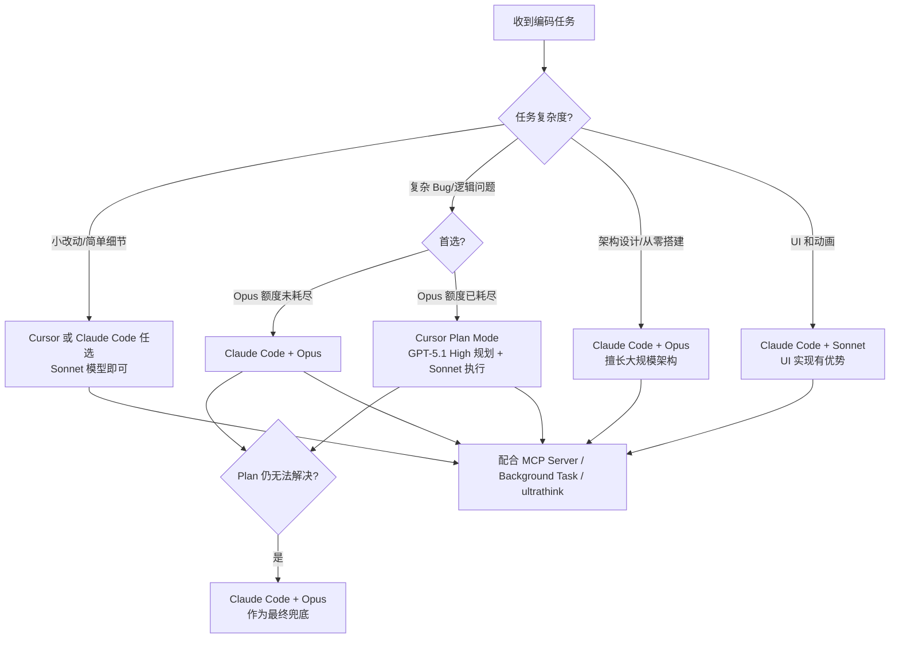

# 单人开发者的 AI 编码工作流：如何用 Claude Code + Cursor 突破产能上限

## 一句话导读

一个人维护多款商业级应用，核心不是选对某个工具，而是把不同 AI 编码工具组合成一套分工明确的协作流程。

## 适合谁看

- 正在用 Cursor 或 Claude Code 做项目，但总觉得产出效率不稳定的人
- 单人开发者或小团队，没有同事帮你做代码审查，担心质量和安全漏洞
- 有一定编程基础，想从「用一个工具蛮干」升级到「多工具协同」的工作流
- 正在学 vibe coding，不知道该从哪个工具入门、什么时候该换工具的人
- 想了解 MCP Server、Plan Mode、ultrathink 等高级用法具体怎么落地的人

## 读完你会获得什么

- 能根据任务复杂度，选择正确的工具和模型组合，不再盲目「全程用一个」
- 能理解 Plan Mode 为什么能提升 20% 以上输出质量，以及如何在 Claude Code 和 Cursor 中分别开启
- 能配置 Context7 和 Supabase 两个 MCP Server，让 AI 直接访问最新文档和数据库
- 能用 ultrathink 关键词让 Claude Code 更深入地思考复杂问题
- 能搭建代码审查机制（Bugbot / Cursor Review），解决单人开发没有 review 的痛点
- 能用语音口述 + 深度研究的方式，大幅提升 prompt 质量和架构决策水平

---

## 01 背景：为什么这个问题现在值得讨论

一个人同时维护多款商业级应用——放在两年前，这在物理上不可能。现在它正在发生。

Chris 是一个单人开发者，独立运营着多款生产力 App。他的核心能力不是写代码更快，而是借助 AI 编码工具，把一个人的产出拉到了过去一个小团队的量级。

但问题随之而来：AI 编码工具越来越多——Cursor、Claude Code、Bolt、v0、Create Anything——每款都在说自己最好。大多数人面对的选择焦虑是：**我到底该选哪个？选定了就坚持下去对吧？**

这个直觉是错的。

Chris 的实践表明：真正高效的做法不是「选一个最好的」，而是**理解每个工具的强项和边界，按任务类型切换使用**。这背后的逻辑和项目经理分配任务一样——不是所有活都该给同一个人干。

与此同时，大量 vibe coder 正在涌入这个领域。他们没有编程基础，靠 AI 工具直接生成代码。但工具本身不会替你思考——不知道何时该用 Plan Mode、不知道 MCP Server 能干什么、不知道 solo 开发者最大的风险是没有人 review 你的代码。这些盲区才是效率瓶颈。

---

## 02 核心判断：工具选型不是单选题，而是组合题

视频表面在讲「我的 AI 编码工具推荐」，实际想讲的是：**AI 编码的生产力突破，不来自某个工具本身，而来自你对工具分工的理解和流程的组合方式。**

具体来说：

- **Claude Code 擅长架构设计和 UI 实现**，但 Opus 模型用量严重受限
- **Cursor 的 Plan Mode 擅长复杂问题的分步拆解**，尤其在追问和方案细化上更强
- **同一个模型（Sonnet 4.5）在 Plan Mode 和非 Plan Mode 下，输出质量差异显著**
- **MCP Server 让 AI 从「只能写代码」升级到「能操作基础设施」**
- **单人开发者最大的系统性风险不是效率低，而是没有代码审查**

这些判断单独看都不新鲜。组合在一起，构成的是一套完整的单人开发工作流设计思路。

---

## 03 概念澄清：先把关键名词讲准确

### Claude Code

- **它是什么**：Anthropic 推出的命令行 AI 编码工具，运行在终端中，能直接读写项目文件、执行命令
- **它解决什么问题**：让 AI 以 agent 形式深入参与编码——不是对话式问答，而是直接动手改代码
- **它不是什么**：不是 IDE，不是代码编辑器，没有图形界面
- **和 Cursor 的区别**：Cursor 是完整的 IDE（代码编辑器 + AI），Claude Code 是终端里的 AI agent，两者运行方式完全不同
- **例子**：在终端里输入 `claude`，然后口述需求，它就会直接修改你项目里的文件

### Cursor

- **它是什么**：基于 VS Code 的 AI 编码 IDE，内置 AI agent 能力，支持 Agent Mode 和 Plan Mode 两种模式
- **它解决什么问题**：在编辑代码的同时，让 AI 参与编码，实现「边写边改」的工作流
- **它不是什么**：不是独立的 AI 模型，底层调用的是 Claude、GPT 等模型
- **和 Claude Code 的区别**：Cursor 是图形化 IDE，有文件树、编辑器、终端；Claude Code 是纯终端交互
- **例子**：在 Cursor 里打开项目，切换到 Plan Mode，输入需求，它会先列出执行计划让你审核，确认后再执行

### Plan Mode

- **它是什么**：AI 编码工具的一种工作模式——AI 先输出执行计划，等用户确认后再动手改代码
- **它解决什么问题**：防止 AI 一上来就改代码，改完发现方向错了还要回退。给 AI「思考时间」，也给人「审核时间」
- **它不是什么**：不是让 AI 写更少的代码，而是让 AI 在写之前先想清楚
- **和 Agent Mode 的区别**：Agent Mode 是 AI 直接执行，Plan Mode 是 AI 先规划再执行。同一个模型，Plan Mode 的输出质量通常更高
- **例子**：你让 AI「给搜索框加动画」，Agent Mode 可能直接改三个文件然后出 bug；Plan Mode 会先列出「第一步改 SwiftUI 视图、第二步加动画修饰符、第三步调整时序」，你确认后再执行

### MCP Server（Model Context Protocol Server）

- **它是什么**：一种让 AI 工具连接外部服务的协议。配置了 MCP Server 后，Claude Code 或 Cursor 就能直接访问第三方平台的数据和功能
- **它解决什么问题**：AI 不再只能操作本地代码，还能读取最新文档、操作数据库、调用 API——相当于给 AI 装了「手」
- **它不是什么**：不是 AI 模型本身，也不是插件市场，是一种通信协议
- **和普通 API 调用的区别**：MCP Server 是 AI 主动调用的工具，不需要你在 prompt 里手动粘贴 API 返回结果
- **例子**：配置了 Context7 MCP 后，你只需要说「用最新版 PostHog 文档集成分析功能」，AI 会自动从 Context7 拉取文档并按最新版本实现

### ultrathink

- **它是什么**：Claude Code 的一个特殊关键词，在 prompt 中输入后，Claude Code 会花更长时间思考问题
- **它解决什么问题**：遇到复杂 bug 或架构决策时，让 AI 不急于给答案，而是更深入地推理
- **它不是什么**：不是魔法咒语，不保证答案一定正确，只是让思考过程更充分
- **和普通 prompt 的区别**：普通 prompt 下 AI 可能快速给出一个「还行」的方案；加了 ultrathink 后，AI 会花大约两倍时间推理，通常能得到更周全的方案
- **例子**：输入「Can you fix this authentication issue? ultrathink」，Claude Code 界面上 ultrathink 会变色，表示它识别到了这个指令并进入深度思考模式

### Background Task（后台任务）

- **它是什么**：Claude Code 的功能，可以让它在后台运行服务器等长时任务，同时继续编码
- **它解决什么问题**：AI 编码时能直接访问服务器日志，不需要你手动复制粘贴错误信息
- **它不是什么**：不是让你同时跑两个 AI 任务，是让 AI 能在编码的同时「看到」服务器状态
- **例子**：输入「在后台运行服务器」，Claude Code 启动服务器后继续编码，当服务报错时它能直接看到日志并修复

---

## 04 整体框架：工具-模型-任务的决策体系

Chris 的工作流可以归纳为一个三层决策框架：**选工具 → 选模型 → 选模式**。

**框架解读：**

核心决策依据是**任务复杂度**，而不是「我习惯用哪个」。简单任务两个工具都能搞定，区别在于复杂任务的处理路径：

1. **架构级任务**（从零搭应用）→ Claude Code + Opus，它擅长大范围代码生成
2. **复杂 Bug**（逻辑疑难）→ Cursor Plan Mode，它更擅长追问和细化方案
3. **UI 和动画**→ Claude Code 有天然优势，即使只用 Sonnet
4. **小改动**→ 两者皆可，取决于当前哪个顺手

当首选方案解决不了时，最终兜底都是 Claude Code + Opus——但 Opus 额度极其有限（一周的量可能 3-4 小时就用完），所以必须谨慎使用。

---

## 05 关键机制：每个环节到底怎么运行

### 机制一：双工具并行的物理布局

- **输入**：一个项目文件夹
- **处理方式**：Cursor 打开项目文件夹，终端拖到右侧运行 Claude Code。两个工具同时操作同一套文件
- **输出**：在 Cursor 标签页和 Claude Code 终端之间随时切换
- **为什么这样设计**：同一个模型在 Plan Mode 和非 Plan Mode 下输出不同，两个工具的交互模式也不同——Cursor 偏结构化规划，Claude Code 偏快速迭代
- **代价**：需要同时保持两个工具的上下文同步，有时会有文件冲突
- **适合**：桌面端开发。iOS 项目同样适用——用 Cursor 编辑文件，Xcode 自动同步并运行

### 机制二：Plan Mode 的「先想后做」

- **输入**：你的需求描述
- **处理方式**：AI 先生成一个分步计划，每一步说明要改什么文件、怎么改、为什么这样改。你审核确认后，AI 才开始执行
- **输出**：一个可审核的执行计划 + 按计划修改后的代码
- **为什么这样设计**：AI 直接执行时，缺少全局视角，容易「改了东墙补西墙」。Plan Mode 强制 AI先做全局规划，输出质量因此提升约 20%
- **代价**：每次交互多了一轮审核，初期感觉「慢了」
- **适合**：复杂逻辑、多文件修改、架构变更。不适合一键式小改动

### 机制三：MCP Server 的「给 AI 装手」

- **输入**：MCP Server 配置（Context7 / Supabase 等）
- **处理方式**：AI 在编码过程中，按需调用 MCP Server 获取外部数据或执行外部操作
- **输出**：AI 直接使用最新文档实现功能，或直接在数据库中创建表、配置权限
- **为什么这样设计**：过去的做法是把文档 URL 贴给 AI，让它自己去抓取——但抓取可能失败、内容可能过时、格式可能不适合 AI 阅读。MCP Server 提供的是「压缩过的、AI 友好的、最新版本的」文档
- **代价**：Supabase MCP 在生产环境有风险——AI 理论上能删除整个数据库。需要权衡效率和安全
- **适合**：项目初始化阶段（用 Supabase MCP 搭建数据库和配置规则）、需要最新文档的集成工作（用 Context7）。生产环境需谨慎，至少用只读模式让 AI 帮你检查配置

### 机制四：ultrathink 的「深度思考模式」

- **输入**：在 prompt 末尾加上 `ultrathink` 关键词
- **处理方式**：Claude Code 识别到关键词后，花更长时间进行推理（大约两倍时间），界面上的 ultrathink 文字会变色确认
- **输出**：更周全、更深思熟虑的方案
- **为什么这样设计**：复杂问题需要更多推理步骤，但 AI 默认倾向于快速给出答案。ultrathink 是一种显式信号，告诉 AI「这个问题值得深入想」
- **代价**：响应时间更长。但实际使用中，token 消耗并没有显著增加
- **适合**：复杂 bug、架构决策、逻辑疑难。不适合简单任务（浪费时间，收益不明显）

---

## 06 方法拆解：从零搭建这套工作流

### 第一步：安装和配置两个核心工具

**目标**：让 Cursor 和 Claude Code 同时可用

**具体动作**：
1. 安装 Cursor（cursor.com），登录并配置 API Key
2. 安装 Claude Code（`npm install -g @anthropic-ai/claude-code`），登录 Anthropic 账号
3. 在 Cursor 中打开项目文件夹，把终端面板拖到右侧
4. 在右侧终端中启动 Claude Code

**判断标准**：两个工具都能读取并修改同一项目文件，切换无延迟

**常见坑**：两个工具同时修改同一文件可能产生冲突。建议：同一时间只让一个工具操作，另一个等待

**产出物**：可用的双工具并行环境

### 第二步：配置模型选择策略

**目标**：在不同工具中配置对应的模型

**具体动作**：
1. Claude Code 中选择 Opus 4.1 模型（复杂任务时），日常用 Sonnet 4.5
2. Cursor 中，Plan Mode 选择 GPT-5.1 High 做规划，执行模型选 Sonnet 4.5
3. 两个工具的 Sonnet 4.5 输出质量接近，可作为通用执行模型

**判断标准**：Cursor Plan Mode 列出的计划是否详细、可审核；Claude Code Opus 的输出是否明显优于 Sonnet

**常见坑**：Opus 额度极容易用完。建议只在关键决策时切换到 Opus，日常全部用 Sonnet

**产出物**：按复杂度匹配的模型配置

### 第三步：开启 Plan Mode 习惯

**目标**：所有非简单任务都走 Plan Mode

**具体动作**：
1. Cursor 中：点击界面上的 Plan Mode 开关
2. Claude Code 中：按 `Shift+Tab` 切换到 Plan Mode
3. 输入需求后，先审核计划，确认再执行

**判断标准**：计划是否覆盖了所有需要修改的文件？是否有遗漏的边界情况？

**常见坑**：Claude Code 的 Plan Mode 输出不如 Cursor 详细。遇到特别复杂的问题，优先用 Cursor Plan Mode

**产出物**：每次修改前有审核记录的工作习惯

### 第四步：配置 MCP Server

**目标**：让 AI 能访问最新文档和数据库

**具体动作**：
1. 安装 Context7 MCP Server（免费）——在 Claude Code 或 Cursor 的 MCP 配置中添加
2. 安装 Supabase MCP Server——按 Supabase 官方文档配置，连接到你的项目
3. 在 prompt 中明确要求 AI 使用 MCP：「请使用 Context7 获取最新文档」

**判断标准**：AI 是否能自动拉取文档而不需要你手动粘贴？AI 是否能直接操作数据库表和权限？

**常见坑**：生产环境慎用 Supabase MCP 的写权限。可以先配置只读权限，让 AI 帮你审查配置是否安全

**产出物**：两个核心 MCP Server 的可用配置

### 第五步：搭建代码审查机制

**目标**：单人开发也能有代码审查

**具体动作**：
1. 注册 Bugbot（GitHub 集成），它会在你每次开 PR 时自动审查代码
2. 或使用 Cursor 内置的代码审查功能（每月 40 美元）
3. 养成习惯：所有改动先开 PR，审查通过再合并

**判断标准**：审查工具是否能捕获安全漏洞和逻辑 bug？误报率是否可接受？

**常见坑**：这些工具不能替代人工审查，但比没有审查强得多。它们尤其擅长发现安全问题和明显 bug

**产出物**：自动化的代码审查流程

### 第六步：掌握辅助技巧

**目标**：用口述和深度研究提升 prompt 质量

**具体动作**：
1. 安装语音输入工具（如 WhisperFlow，支持开发者术语识别）
2. 用口述代替打字写 prompt——口述的内容天然更详细
3. 遇到技术选型问题，在 Claude Desktop 中使用 Deep Research 功能，让它搜索 10-15 分钟找到最佳方案
4. 将研究结果喂给 Claude Code 或 Cursor 执行

**判断标准**：prompt 的信息密度是否显著高于手写？Deep Research 返回的方案是否经得起追问？

**常见坑**：Deep Research 的结论也需要你判断。不要盲信，追问「为什么选这个方案而不是那个？」

**产出物**：高密度 prompt + 事前技术调研的工作模式

---

## 07 案例讲解：用 AI 复刻一个交互动画

**场景背景**：Chris 的热量追踪 App「Amy」有一个搜索动画——输入关键词后，界面依次显示「搜索中」→「分析中」→「已找到 X 个来源」→「计算热量」，每一步都有精致的过渡动画和闪光效果。

**遇到的问题**：这种多层交互动画，传统写法需要精确控制时序、动画曲线和视图层级，即使有经验也要几小时。

**按框架如何处理**：

1. **选工具**：这次用 Claude Code（UI 和动画是它的强项），同时在 Cursor Plan Mode 中并行运行做对照
2. **写 prompt**：用口述方式输出极度详细的描述——「点击按钮后，先显示'searching'并加闪光文字动画，1 秒后向下推出，替换为'analyzing'同样从顶部落入，保持闪光效果，然后显示'found 1 sources'配三个圆形图标代表来源，最后显示'calculating'和硬编码的热量数字，确保所有替换内容在一行内截断显示」
3. **首次执行**：Claude Code 生成了基础动画，但过渡不流畅——「搜索中」退出时向上弹回而非向下推出
4. **迭代修复**：追加 prompt 指出具体问题：「退出时的动画方向不对，应该向下推出而非弹回。每步动画时间延长到 2 秒。闪光效果再明显一些」
5. **对照实验**：Cursor Plan Mode 的首次输出反而更流畅——因为 Plan Mode 先规划了动画时序

**每步怎么做**：
- 用 Slow Animations（模拟器顶部菜单）逐帧检查动画细节
- 发现问题后给出具体的修改指令，不是笼统说「效果不好」
- 重复迭代 2-3 次后达到可用状态，10-20 轮 prompt 后达到最终效果

**最终结果**：整个动画从空白项目到可用状态约 2 小时。首次尝试中，Cursor Plan Mode 的输出略优于 Claude Code 的直接执行——印证了 Plan Mode 的价值。

**说明了什么**：同一个模型，Plan Mode 和非 Plan Mode 的输出差异肉眼可见。prompt 的详细程度直接决定了首轮输出的质量——口述之所以有效，正是因为它天然产出更细粒度的描述。

---

## 08 常见误区

**误区一：我必须选一个最好的工具，坚持用下去**

- 错误理解：Cursor 和 Claude Code是竞品，选一个就行
- 为什么错：它们的强项不同——Claude Code 擅长大架构和 UI，Cursor Plan Mode 擅长复杂问题拆解
- 正确理解：它们是互补工具，同一个项目里按任务类型切换
- 应该怎么做：同时配置两个工具，根据任务性质选择

**误区二：Opus 模型一定比 Sonnet 好，能选就选**

- 错误理解：既然 Opus 最强，所有任务都应该用 Opus
- 为什么错：Opus 额度极其有限，一周的量可能 3-4 小时就耗尽。简单任务用 Opus 是浪费
- 正确理解：Opus 是稀缺资源，留给真正需要深度推理的任务
- 应该怎么做：日常用 Sonnet，只在架构决策和复杂 bug 时切 Opus

**误区三：Plan Mode 只是多了一步确认，太麻烦**

- 错误理解：Plan Mode 等于「AI 先说一遍要干嘛，我再点确认」，纯属浪费时间
- 为什么错：Plan Mode 改变的是 AI 的推理方式，不是交互流程。强制 AI 先做全局规划，输出质量显著提升
- 正确理解：Plan Mode 是提升 AI 输出质量最简单有效的手段，约 20% 的质量提升
- 应该怎么做：所有中等复杂度以上的任务，默认走 Plan Mode

**误区四：MCP Server 不安全，不该用**

- 错误理解：给 AI 数据库操作权限太危险，绝对不能用
- 为什么错：你自己手动配置安全规则，出错的概率可能更高。AI 用 Supabase MCP 配置的规则，往往比手动配置更完整
- 正确理解：MCP 的风险是真实的，但可以通过权限控制和使用策略来管理
- 应该怎么做：项目初始化阶段大胆用，生产环境用只读模式审查配置。至少让 AI 帮你检查安全规则是否正确

**误区五：我是一个人开发，代码审查不重要**

- 错误理解：代码审查是团队的事， solo 开发者不需要
- 为什么错：solo 开发者移动速度快，bug 和安全漏洞几乎不可避免。没有审查，问题直接进生产环境
- 正确理解：solo 开发者比团队更需要自动化审查——因为没有人帮你看代码
- 应该怎么做：配置 Bugbot 或 Cursor Review，每月 40 美元买的是「能睡好觉」

**误区六：新手应该直接上 Claude Code 或 Cursor**

- 错误理解：最强的工具就是最好的入门选择
- 为什么错：Claude Code 和 Cursor 需要你理解项目结构、文件系统和 prompt 技巧，新手很容易迷失
- 正确理解：先用更简单的工具建立直觉，遇到天花板再升级
- 应该怎么做：从 Create Anything、v0 或 Bolt 开始，学会如何描述需求，再过渡到专业工具

**误区七：prompt 写得短没关系，AI 足够聪明能猜到**

- 错误理解：AI 很聪明，简单说一句它就知道我要什么
- 为什么错：AI 编码时需要精确的约束——动画时序、交互逻辑、边界处理——信息越少，猜测越多，结果越偏离
- 正确理解：prompt 的详细程度直接决定首轮输出质量。用口述替代打字，信息密度自然提升
- 应该怎么做：用语音输入工具口述 prompt，把你能想到的细节都说出来

---

## 09 实战清单：读完后可以马上照着做

### 立即能做

1. **在 Claude Code 中试一次 ultrathink**：遇到手头的复杂问题，在 prompt 末尾加上 `ultrathink`，观察输出质量差异
2. **在 Cursor 中打开 Plan Mode**：用同一个需求分别跑 Plan Mode 和 Agent Mode，对比输出
3. **安装 WhisperFlow 或其他语音输入工具**：用口述写一次 prompt，感受信息密度的提升
4. **在 Claude Code 中运行后台任务**：输入「在后台运行服务器」，体验 AI 自动读取日志的能力

### 一周内能做

1. **配置 Context7 MCP Server**：让它接入你项目使用的框架文档，试试让 AI 用最新文档集成功能
2. **配置 Supabase MCP Server**（或你使用的数据库的 MCP）：先用只读模式，让 AI 审查你的数据库配置是否安全
3. **注册 Bugbot 并接入 GitHub 仓库**：开一次 PR，看看自动审查能捕获什么
4. **建立双工具并行环境**：Cursor + 右侧终端运行 Claude Code，在同一项目上试一次并行对照

### 长期要沉淀

1. **建立自己的任务-工具匹配表**：记录哪类任务用哪个工具效果最好，持续优化
2. **养成 Plan Mode 习惯**：非简单任务全部走 Plan Mode，每次审核计划时训练自己的架构判断力
3. **用 Claude Deep Research 做技术调研**：在动手实现前，先让 AI 做 10-15 分钟的深度搜索，选出最佳方案再编码
4. **定期回顾 AI 生成的安全配置**：MCP 和代码审查工具帮你搭的配置，每季度复查一次

---

## 10 总结

AI 编码工具正在把单人开发者的产能上限不断推高。但工具本身只是放大器——它放大的是你的工作流设计能力。

Chris 的工作流核心不是某个工具的技巧，而是一套**按任务性质分配工具和模型**的决策体系。Claude Code 做架构和 UI，Cursor Plan Mode 做复杂问题拆解，Sonnet 做日常执行，Opus 做关键决策——每个环节都有明确的选择逻辑。

Plan Mode、ultrathink、MCP Server、后台任务、代码审查——这些不是锦上添花的功能，而是改变 AI 编码工作方式的机制。Plan Mode 把 AI 从「急着动手」变成「先想清楚」；MCP Server 把 AI 从「只能写代码」变成「能操作基础设施」；代码审查把 solo 开发从「裸奔」变成「有安全网」。

对于刚入门的 vibe coder，最务实的路径是：先用简单工具建立直觉，再升级到专业工具组合。不要一上来就追求最强的模型——先用 Sonnet 把工作流跑通，再在关键节点引入 Opus。

一个人做多款应用这件事已经成立了。但成立的前提不是某个工具足够强，而是你对工具分工的理解足够清晰。
