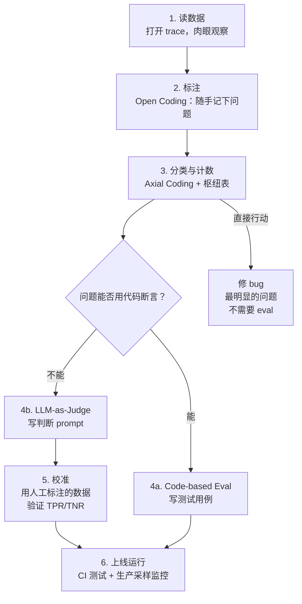

# AI 评估的正确打开方式：别急着建仪表盘，先看一百条对话

# 一句话导读

大多数团队做 AI 评估的第一步就错了——他们跳过了最值钱的部分：用肉眼读数据、数问题，然后才谈自动化。

# 适合谁看

- 正在构建 AI 产品的产品经理，不知道 evals 从哪里下手
- 已经在用 LLM-as-Judge 但对评分结果将信将疑的工程师
- 被供应商的"开箱即用评估面板"吸引，想判断它值不值用的团队负责人
- 需要向利益相关者汇报 AI 产品质量，但指标总对不上体感的 PM
- 刚上线 AI 功能、收到用户投诉却不知道问题出在哪的创业者

# 读完你会获得什么

- 理解为什么"看数据+数问题"比任何自动化评分都重要，以及具体怎么看、怎么数
- 掌握从原始对话记录到可运行评估的完整路径：标注→分类→计数→建判官→校准→上线
- 能区分什么时候该用代码断言、什么时候必须上 LLM-as-Judge，以及为什么评分一定要二值化
- 理解为什么"一致率"(agreement) 是个危险指标，以及应该用什么替代
- 能用维度思维生成高质量合成测试数据，而不是让 LLM 随机编问题
- 有一份可照做的行动清单，从今天就能开始改进自己的 AI 产品

---

## 01 背景：为什么这个问题现在值得讨论

AI 产品正在从"能跑起来"走向"跑得好"。大量团队已经把 LLM 接进了产品，对话式助手、智能客服、文档分析、代码生成——功能有了，质量却参差不齐。

于是市场上出现了一批"评估解决方案"：插上就能用，给你一个仪表盘，显示幻觉分数、有害性分数、一致性分数。看起来很专业，但实际问题依然存在：用户还在投诉，对话还在死循环，转人工的时机还是错的。

**根本矛盾在于：通用指标和你产品里的真实问题之间，几乎没有对应关系。** 一个 37 分的"有用性评分"比 32 分好了多少？好在哪里？能指导你改什么？没人说得清。

与此同时，一个最朴素的做法——打开对话记录，读它，记下问题，数一数——却被几乎所有人跳过了。原因是它看起来太简单、太原始、太不像"工程"。

但正是这个做法，蕴含着最大的价值。

---

## 02 核心判断：评估的第一步不是建评估，是理解问题

视频表面上在教"如何做 AI 评估"，但真正的判断是：

**评估的价值不在于评分，在于问题发现。** 一个团队如果跳过"读数据、理解问题"这一步，直接上自动评分，会得到一堆数字，但这些数字既不能指导迭代，也不能赢得信任。

更具体地说：

- 评估的起点是标注（annotation），不是算法
- 评估的目标是决策（够不够好），不是打分（几分）
- 评估的校准靠人的判断，不是靠一致率
- 评估的终点是产品改善，不是仪表盘好看

**如果你只能做一件事，就做标注和计数。** 哪怕你不建任何自动评估，光这一步就能给你巨大的价值。可惜这正是所有人跳过的一步。

---

## 03 概念澄清：先把关键名词讲准确

### Trace（对话轨迹）

- **是什么**：一次用户与 AI 完整交互的日志记录，包含系统提示词、用户消息、AI 回复、工具调用、内部中间步骤——用户看到和没看到的全部内容
- **解决什么问题**：让你看到 AI 产品真实发生了什么，而不仅仅是用户反馈或汇总指标
- **不是什么**：不是用户评分、不是错误日志、不是简单的问答对记录
- **和相关概念的区别**：Trace 是原始数据，Eval 是基于 Trace 的判断，Dashboard 是 Eval 结果的展示
- **例子**：一个房产租赁助手的 trace 里，用户问"有两居室吗？"，AI 调用了查房源工具但返回为空，对话直接中断——用户只看到沉默，你在 trace 里看到了故障

### Open Coding（开放编码）

- **是什么**：读数据时随手写下的观察笔记，不预设分类，看到什么记什么
- **解决什么问题**：避免带着预设框架看数据，让问题从数据中自然浮现
- **不是什么**：不是根因分析，不是调试，不是写 bug 报告——你只是观察和记录
- **和相关概念的区别**：Open Coding 是"记下看到的"，Axial Coding 是"把记下的分组"
- **例子**：读到一条 trace，你写"用户要求转人工，AI 又问了三个问题才转"——这就是一个 open code

### Axial Coding（轴心编码）

- **是什么**：把 open code 的零散笔记归类到几个有意义的类别中
- **解决什么问题**：从几百条零散观察中提炼出几类核心问题，让数据可计数、可行动
- **不是什么**：不是穷举分类法，不是完美分类——够用就好，可以迭代
- **和相关概念的区别**：Open Coding 发散，Axial Coding 收敛
- **例子**：你把"转人工被忽略""转人工前问太多问题""转人工失败"都归为"人工转接问题"这个 axial code

### LLM-as-Judge（LLM 评判）

- **是什么**：用另一个 LLM 来判断你的 AI 产品输出是否符合特定标准
- **解决什么问题**：当判断标准难以写成代码断言（如"是否应该转人工"）时，用 LLM 的语言理解能力来替代人工判断
- **不是什么**：不是让 LLM 说"这个回答好不好"——必须给出明确的判断规则和二值化输出
- **和相关概念的区别**：Code-based eval 有确定答案（日期对不对），LLM-as-Judge 处理需要主观判断的问题（该不该转人工）
- **例子**：你写一个 prompt："判断这次对话是否存在人工转接失败。存在以下情况之一即为失败：1）用户要求转人工但被忽略；2）AI 循环提问超过 3 次仍未转接……返回 true 或 false。"

### True Positive Rate / True Negative Rate（真正率/真负率）

- **是什么**：真正率 = 评判器在问题确实存在时正确识别的概率；真负率 = 评判器在问题确实不存在时正确放过的概率
- **解决什么问题**：分别衡量评判器"抓到问题"和"不错怪"的能力
- **不是什么**：不是一致率（agreement/accuracy），一致率会被类别不平衡严重扭曲
- **和相关概念的区别**：一致率在问题发生率 10% 的场景下，只要评判器永远说"没问题"就能拿到 90%——但这个评判器毫无价值
- **例子**：100 条 trace 中 9 条有人工转接问题。评判器找到了其中 7 条（真正率 78%），在 91 条没问题中误报了 18 条（真负率 80%）。这时你看得到两类错误的具体情况，而不只是一个 82% 的"一致率"

---

## 04 整体框架：AI 评估的六个阶段

整个评估流程不是从工具选型开始，而是从读数据开始，逐步构建出可自动化的判断能力。

**文字解释**：

1. **读数据**是起点，也是整条链路中最被低估的环节。不读数据，你不知道要评估什么。
2. **标注**产生 open code——对问题的原始观察。这一步不需要任何工具，用 spreadsheet 就行。
3. **分类与计数**把零散观察变成可量化的问题分布。你立刻能看到哪些问题最严重。
4. **决策点**：有些问题（如日期格式错误）可以用代码直接断言，成本低、速度快；有些问题（如"是否应该转人工"）需要语言理解，必须用 LLM-as-Judge。
5. **校准**是 LLM-as-Judge 的生死线——不校准，你的评判器可能只是在猜。
6. **上线运行**把评估嵌入 CI 流程和生产监控，形成持续反馈。

注意：从第 3 步到"直接行动"有一条捷径。如果你发现的问题足够明显（比如日期一直算错），直接修，不需要建评估。评估是为需要反复迭代的复杂问题准备的。

---

## 05 关键机制：每个环节到底怎么运行

### 机制一：Trace 阅读与标注

**输入**：AI 产品的对话日志（trace），每条包含完整的系统提示词、用户消息、AI 回复、工具调用记录

**中间处理**：
- 逐条打开 trace，像读聊天记录一样阅读
- 看到"不对"的地方，写一句笔记（open code）
- 不做根因分析，不写解决方案，只记录观察
- 前几条会慢，到了第 10 条你已经形成了直觉，速度会快很多

**输出**：每条 trace 对应 0-2 条文字笔记，描述你看到的问题

**为什么要这样设计**：人的模式识别能力远强于任何现成的自动指标。你读完 100 条 trace 后对产品的理解，是任何幻觉分数、一致性分数给不了的。而且标注的过程本身就是人类标记，这是后续一切自动化评估的校准基础。

**代价**：时间成本约 1 小时（100 条 trace）。需要有人愿意坐下来读数据。看似简单，但这恰恰是团队最容易跳过的一步。

**适合场景**：产品已上线有真实数据，或已内测有测试数据。不适合完全没有数据的阶段（那时需要用合成数据，见机制四）。

### 机制二：Axial Coding 与计数

**输入**：100 条左右的 open code 文字笔记

**中间处理**：
- 把所有笔记交给 LLM，让它提出 5-6 个分类（或自己归纳）
- 可以用提示词中的"open code / axial code"术语，LLM 对这套社会科学方法论有精确理解
- 分类不需要完美，可以迭代调整
- 用 LLM 把每条笔记归入一个类别
- 用枢纽表（pivot table）计数

**输出**：一张问题分布表——几类问题各出现了多少次

**为什么要这样设计**：从"我隐隐觉得有问题"到"人工转接问题出现了 23 次，是最多的"——这个转变让你从模糊走向具体。具体才能行动。

**代价**：分类可能有主观性，不同人可能归出不同类别。但这不是问题——分类的目的是让问题可行动，不是学术严谨。

**适合场景**：只要完成了 open coding，就应该做这一步。不需要等"完美的分类方案"。

### 机制三：LLM-as-Judge 的设计与校准

**输入**：需要自动判断的问题类别（如"人工转接是否失败"）、人工标注的 ground truth 数据

**中间处理**：
- 写一个判断 prompt，明确列出"什么算失败"的具体条件
- 输出格式强制为二值（true/false），不要评分
- 用已有的人工标注数据作为校准集
- 跑一遍评判器，对比人工标注，计算真正率和真负率
- 看混淆矩阵，找到误判的 case，调整 prompt
- 如需在 prompt 中加入 few-shot 示例，必须留出一部分数据不做训练用，避免过拟合

**输出**：一个经过校准的 LLM-as-Judge，附有 TPR 和 TNR 指标

**为什么要这样设计**：LLM-as-Judge 如果不校准，就是"让一个黑箱判断另一个黑箱"，没人会信任结果。校准让你知道评判器在什么情况下会犯错，犯错是否可接受。二值输出避免了连续分数带来的伪精确感——37 分比 32 分好了什么？没人知道。true/false 至少能让你说"这个问题存在/不存在"。

**代价**：LLM-as-Judge 比代码断言贵得多。每个评判都需要一次 LLM 调用。但如果你要反复迭代某个复杂问题的解决方案，这个成本是值得的——因为它让你有了可运行的自动化测试。

**适合场景**：判断标准涉及语义理解、上下文推理的问题。不适合有确定答案的检查（如日期格式、字段存在性）。

### 机制四：合成数据生成

**输入**：产品的关键维度（用户类型、场景类型、问题类型等）

**中间处理**：
- 列出维度：如用户身份（潜在租客 vs 物业经理）、物业档次（豪华 vs 标准）、交互渠道（电话 vs 文字）
- 用维度的组合作为输入，让 LLM 生成各类场景下的用户提问
- 这比直接让 LLM"编一些问题"好得多——维度组合确保了覆盖面

**输出**：一组覆盖不同维度组合的测试用例

**为什么要这样设计**：直接让 LLM"生成一些用户可能问的问题"，输出会高度同质化。维度思维强制你思考输入空间的边界，确保边缘场景被覆盖。

**代价**：维度设计需要产品判断力——你列出的维度质量决定了合成数据的质量。维度遗漏会导致盲区。

**适合场景**：产品上线前、数据不足时。上线后应尽快用真实数据替代或补充。

---

## 06 方法拆解：如果自己要做，应该怎么落地

### 第一步：收集 100 条 trace

**目标**：拿到足够量的真实交互数据

**具体动作**：
- 如果产品已上线，从可观测性平台（如 Braintrust、LangSmith、Arize）导出 trace
- 如果产品未上线，先用维度法生成合成输入，跑一遍系统，拿到 trace
- 如果连系统都没搭好，先自己用、团队内测，积累交互记录

**判断标准**：100 条是起步数。不需要正好 100 条，但需要一个具体数字——不给数字，团队不会开始。

**常见坑**：只看用户投诉，不看正常 trace。投诉只反映冰山一角。

**产出物**：100 条可读的 trace 记录

### 第二步：逐条阅读，写 open code

**目标**：形成对产品真实问题的直觉

**具体动作**：
- 一条一条打开 trace，从头读到尾
- 看到"不对"的地方，写一句笔记。格式随意，关键是记录你看到了什么
- 不做根因分析，不写解决方案。只观察
- 前几条会很慢（5-10 分钟一条），后面会越来越快（1-2 分钟一条）

**判断标准**：当你连续读 10 条 trace 都没发现新类型的问题时，说明已经接近理论饱和（theoretical saturation），可以停下来。

**常见坑**：试图在阅读阶段就解决问题。克制住。你的目标是理解问题全貌，不是修 bug。

**产出物**：每条 trace 附 0-2 条文字笔记，总共约 80-150 条 open code

### 第三步：分类、计数、排优先级

**目标**：把零散观察变成可量化的问题分布

**具体动作**：
- 把所有 open code 导入 spreadsheet
- 让 LLM 帮你归成 5-6 类（提示词中用"open code → axial code"术语效果更好）
- 检查分类结果，调整不合意的类别
- 用枢纽表计数每类问题出现次数
- 按频次排序

**判断标准**：分类不需要完美。能在 5 分钟内解释清每个类别代表什么，就够了。

**常见坑**：花太多时间打磨分类方案。分类方案可以迭代，不要为此停滞。

**产出物**：一张问题分布表，显示每类问题的出现次数

### 第四步：决定哪些问题需要评估

**目标**：区分"直接修"和"需要评估来迭代"的问题

**具体动作**：
- 对于原因明确、修复简单的问题（如日期错误），直接修，必要时写代码断言
- 对于标准模糊、需要反复迭代的问题（如人工转接判断），规划 LLM-as-Judge
- 对于优先级低、频次少的问题，暂不处理

**判断标准**：问自己——"修了之后还会反复出现吗？"如果会，需要评估；如果不会，直接修。

**常见坑**：给所有问题都建评估。大多数产品只需要不到 12 个评估。评估越多，维护成本越高。

**产出物**：一份评估规划——哪些用 code-based eval，哪些用 LLM-as-Judge，哪些暂不需要

### 第五步：构建 LLM-as-Judge 并校准

**目标**：得到一个可信的自动评判器

**具体动作**：
- 写判断 prompt：列出"什么算问题"的 5-8 个具体条件，也列出"什么不算问题"的情况
- 输出格式设为二值（true/false）
- 用第二步中的人工标注作为 ground truth
- 跑一遍，对比结果，画混淆矩阵
- 计算真正率和真负率
- 找到误判的 case，阅读它们，调整 prompt
- 如需加 few-shot 示例，留出一部分数据不用，防止过拟合

**判断标准**：TPR 和 TNR 没有统一合格线，这是业务决策。但一个基本底线：评判器在问题存在和不存在两种情况下的识别能力都该明显优于随机猜测。如果某一侧很差（如 TPR 只有 30%），说明评判器在抓问题上不可靠。

**常见坑**：用一致率（agreement）作为指标。在类别不平衡的场景下，一致率会严重误导——一个永远说"没问题"的评判器在问题率 10% 的场景下能拿到 90% 一致率，但它毫无用处。

**产出物**：一个经过校准的 LLM-as-Judge prompt，附 TPR/TNR 和混淆矩阵

### 第六步：嵌入工作流

**目标**：让评估持续运行，而不仅仅是一次性活动

**具体动作**：
- CI 集成：每次代码变更时跑 code-based eval 和 LLM-as-Judge eval
- 生产监控：对生产 trace 采样（比例取决于流量——流量大采样少，流量小可以全跑），定期跑评判器
- 人工标注：在系统有重大变更时重新做一轮完整标注，平时按固定节奏（每周/每月）做小规模标注
- 汇报：可以有一个聚合分数，但必须能下钻到每个评估的具体 TPR/TNR

**判断标准**：评估在持续运行，且每次产品迭代你都会看评估结果。如果评估没人看，说明评估没在解决真实问题。

**常见坑**：建了一堆评估但没人维护。评估需要持续投入——每个 LLM-as-Judge 的 prompt 都需要随产品演进而更新。

**产出物**：CI 配置 + 生产监控采样方案 + 人工标注节奏

---

## 07 案例讲解：Nurture Boss 的人工转接问题

**场景背景**：Nurture Boss 是一个 AI 驱动的物业管理助手，替公寓处理潜在租客的咨询和预约。它接听电话、回答问题、安排看房、处理入住申请。系统已经上线，有真实用户交互数据。

**遇到的问题**：用户投诉不少，但投诉内容分散——有人说 AI 答非所问，有人说预约日期错误，有人说转人工困难。没人知道哪个问题最严重，也没人知道从哪里开始改。

**按框架如何处理**：

**第一步**：Jacob（Nurture Boss 创始人）在 Hamel 的指导下，打开 Braintrust 里的 100 条 trace，逐条阅读。前几条很痛苦——不知道该看什么。但到第 10 条，他已经开始快速识别出模式。

一条典型的 trace：用户说"preview program"（某个项目名），AI 不理解，追问了一堆问题，用户反复说"我想跟人说话"，AI 又追问"你是想了解更多社区信息吗"，最终在用户第三次要求后才转接。Jacob 写下笔记："用户要求转人工，AI 循环提问多次才执行。"

**第二步**：100 条 trace 看完，Jacob 有了约 100 条 open code。他们把笔记导出，让 LLM 做 axial coding，归出几类问题：人工转接问题、预约/日期问题、对话流程问题、格式错误、虚假承诺、调度/重新调度问题。

**第三步**：枢纽表一拉，人工转接问题频次很高。但还有一个更简单的问题排第一——日期处理错误。AI 不知道今天的日期，预约总是约错天。

**直接修**：日期问题原因明确——prompt 里没给当前日期。加上后问题基本消失。顺手写了个代码断言：输出日期是否等于预期日期。不需要 LLM-as-Judge，不需要复杂评估。

**需要评估的**：人工转接问题更复杂。什么情况下应该转？AI 循环多少次算失败？这类问题需要语言理解，需要反复迭代。决定建 LLM-as-Judge。

**构建评判器**：写了一个 prompt，列出 7 种人工转接失败的情形（用户要求转人工但被忽略、循环提问超 N 次仍未转接等），也列了不应该判定为失败的情况，输出格式为 true/false。

**校准**：用之前标注的数据做 ground truth，跑评判器，画混淆矩阵。结果：91 条无问题的 trace 中，评判器误报了 18 条；9 条有问题的 trace 中，评判器抓到了 8 条。TPR 不错，但误报率偏高——18 条误报意味着有 18 次"假警报"需要人工核查。

**迭代 prompt**：去看那 18 条误报的 trace，理解评判器为什么判错了。调整 prompt 中的判断条件。再跑一遍，看 TPR 和 TNR 是否改善。

**最终结果**：Nurture Boss 团队从这个过程中获得了两样东西——（1）对产品问题的深刻理解，这来自读 trace 本身；（2）一个可运行的自动评判器，可以在 CI 和生产环境中持续监控人工转接质量。Jacob 后来甚至自己花了不到 4 小时用 AI 搭了一个内部标注工具，把整个标注流程固化下来。

**说明了什么**：最有价值的产出不是评估指标，不是仪表盘，而是"读过数据、理解问题"这个动作本身。评估工具是为了让这个动作可重复、可规模化。顺序不能反过来。

---

## 08 常见误区

### 误区一：直接上通用指标

**错误理解**：幻觉分数、有用性分数、有害性分数——装上就能用，评估不用自己建。

**为什么错**：通用 prompt 产生的通用分数，和你产品里的真实问题几乎没有对应关系。一个 32 分的幻觉分数降到 28 分，你不知道产品好了什么。更糟的是，你会花大量时间讨论这些分数的含义，而这些时间本可以用来解决真实问题。

**正确理解**：通用指标的唯一正确用法是当作采样工具——用它们对 trace 排序，看高分和低分的 trace 里是否真有值得注意的问题。但永远不要直接汇报这些分数。

**应该怎么做**：先做标注和计数，从真实问题出发构建评估。

### 误区二：评分比二值判断更"科学"

**错误理解**：1-5 分比 true/false 信息量更大，更精确。

**为什么错**：LLM 不擅长输出连续分数。两个评分者对"3 分还是 4 分"的分歧远大于"有问题/没问题"的分歧。更关键的是，当你看到平均分从 3.2 变成 3.5，你不知道产品好了什么、好了多少、该怎么继续改。分数制造了伪精确感，让你以为在做科学测量，实际上是在做假决策。

**正确理解**：二值判断迫使你画出"够好/不够好"的线。这条线本身就是最重要的产品决策。评分则让你回避这个决策。

**应该怎么做**：输出格式设为 explanation + binary score（有条件时附上解释，帮助调试评判器）。极少数场景（如检索排序）才需要连续分数。

### 误区三：一致率够了就行

**错误理解**：评判器和人工标注一致率 90%，说明评判器很好。

**为什么错**：如果你的 AI 产品 90% 的时间没出问题，一个永远输出"没问题"的评判器就能拿到 90% 一致率。但它会漏掉所有真实问题。一致率在类别不平衡时会被多数类严重扭曲。

**正确理解**：你需要看两个独立指标——真正率（问题存在时能抓住的概率）和真负率（问题不存在时能正确放过的概率）。两者独立，不能合成一个数字就完事。

**应该怎么做**：计算 TPR 和 TNR，画混淆矩阵。当有人向你汇报一致率时，追问：基线错误率是多少？如果错误率 10%，90% 一致率意味着评判器可能什么都没抓住。

### 误区四：评估越多越好

**错误理解**：建一个全面的评估套件，覆盖所有维度，才能保证质量。

**为什么错**：每个 LLM-as-Judge 都需要维护——prompt 要随着产品迭代更新，校准要定期重做。评估越多，维护成本越高。而且大多数评估会指向你已经知道的问题，新增信息有限。

**正确理解**：大多数产品只需要不到 12 个评估。优先覆盖那些（1）频繁出现、（2）用户感知强烈、（3）需要反复迭代才能解决的问题。

**应该怎么做**：从标注计数的结果出发，只给排名靠前且需要自动化的几类问题建评估。克制建评估的冲动。

### 误区五：产品没上线就不能做评估

**错误理解**：等有了真实用户数据再开始做评估。

**为什么错**：等到上线，你已经在用真实用户做测试了。早期内测和合成数据可以帮你提前发现问题。

**正确理解**：上线前用维度法生成合成输入，跑系统拿 trace，做标注。上线后用真实数据替代。越早开始读数据越好。

**应该怎么做**：列出产品的关键维度（用户类型、场景、渠道等），用维度组合生成测试输入，跑系统，读 trace。同时自己用、团队内测，积累真实交互数据。

### 误区六：LLM-as-Judge 就是让 LLM 说"好不好"

**错误理解**：给 LLM 一段对话，问"这个回答好不好"。

**为什么错**：这是让一个黑箱判断另一个黑箱。没有具体标准、没有校准、没有二值化输出——结果不可解释、不可重复、不可信任。

**正确理解**：LLM-as-Judge 的 prompt 必须包含具体的判断规则（什么算好、什么算不好），输出必须是结构化的（解释 + 二值判断），评判器必须用人工标注数据校准，TPR/TNR 必须可查。

**应该怎么做**：写 prompt 时像写产品需求文档一样——列出明确的判断条件，区分正例和反例，输出结构化结果，用人工数据校准。

### 误区七：标注只需要做一次

**错误理解**：做完一轮标注，有了 ground truth，以后就只跑自动评估。

**为什么错**：产品在迭代，问题类型在变化。去年的人工转接问题和今年的可能不一样。ground truth 会过期。

**正确理解**：标注是持续活动。重大产品变更后必须重新做，平时也要按固定节奏（每周/每月）做小规模标注。

**应该怎么做**：在日历上固定标注节奏。系统大改后立即做一轮完整标注。考虑搭建内部标注工具，降低标注的启动成本。

### 误区八：evals 是独立的工程任务

**错误理解**：评估是工程师的事，和产品决策无关。

**为什么错**：评估的核心——"什么算好、什么算不好"——是产品决策。"转人工的标准"不是技术问题，是产品判断。读 trace 时需要戴产品帽子，问"这是我要给用户的体验吗？"

**正确理解**：评估是产品工作和工程工作的交叉点。PM 必须参与标注、参与评判标准制定、参与校准判断。

**应该怎么做**：PM 和工程师一起读 trace。PM 主导判断标准的制定，工程师负责自动化实现。

---

## 09 实战清单：读完后可以马上照着做

### 立即能做

- **打开你 AI 产品的可观测性平台**（或对话日志），导出最近 100 条 trace。如果还没有可观测性，今天就把对话记录的存储加上
- **读 10 条 trace**。不分类、不分析、不改 bug——只是读，写下你觉得"不对"的地方。体会这个过程给你带来的认知变化
- **检查你现有的评估指标**：有没有用一致率（agreement）汇报的？有没有用 1-5 分评分的？如果有，追问 TPR 和 TNR 是多少

### 一周内能做

- **完成 100 条 trace 的 open coding**。约 1 小时工作量。用 spreadsheet 记录笔记
- **做 axial coding + 枢纽表计数**。用 LLM 帮你归 5-6 类，拉个 pivot table，看问题分布
- **对频次最高且原因明确的问题，直接修复**。不需要评估，改完验证就好
- **列出你的产品维度**：用户类型、场景、渠道等。用维度组合生成 20-30 条合成测试输入，跑一遍系统

### 长期要沉淀

- **为需要反复迭代的前 2-3 类问题构建 LLM-as-Judge**。写 prompt、校准、记录 TPR/TNR。不要一次建太多
- **把 code-based eval 和 LLM-as-Judge 嵌入 CI**。每次代码变更自动跑评估
- **建立标注节奏**：重大变更后完整重做，平时每周或每月小规模标注。考虑搭建内部标注工具降低启动成本
- **定期重读 trace**。不要只看指标数字——每隔一段时间，重新打开原始数据，用肉眼读。这是对抗指标与体感脱节的最有效方式

---

## 10 总结

AI 评估的起点不是工具选型，不是指标设计，不是供应商的即插即用面板。起点是一个朴素到令人怀疑的动作：坐下来，读你的产品在和用户说什么，记下你觉得不对的地方，数一数。

这个过程——标注和计数——看起来太简单了，简单到不像"工程"。但它才是整个评估体系的地基。你读完 100 条 trace 后对产品的理解，是任何自动化方案给不了的。而且这些标注天然就是你后续校准 LLM-as-Judge 的 ground truth。

从标注出发，你才能回答评估的核心问题：我到底要评估什么？标准是什么？哪些问题值得建自动评估，哪些直接修就行？没有这个过程，你只会得到一堆和真实问题脱节的分数。

当你确实需要 LLM-as-Judge 时，记住三条铁律：二值化输出，校准 TPR/TNR，永远不要只看一致率。评分制造伪精确感，一致率掩盖真实问题。你要的是能做决策的判断，不是能在仪表盘上好看的数据。

最后，评估不是一次性项目，是持续活动。产品在变，问题在变，ground truth 在过期，评判器的 prompt 需要迭代。定期重读 trace，定期重新标注，这是保持评估体系和真实体感对齐的唯一方式。

**一句话收束：评估的第一性原理是理解问题，不是量化问题。如果你只能做一件事，就去读一百条对话。**
